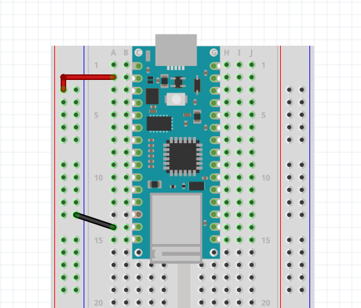

# Blink

## Basic Board Familiarity

### Connecting Power to the Breadboard

Before we start programming with the Nano board, we should first familirize ourselves with how to get power and build a simple circuit like we did before with the LED.

We want to recreate the simple LED-resistor circuit that we built in TinkerCAD, but instead of using a battery, we are going to use the Arduino to power it.

<div>
</img>
</div>

Take note on the pinout document where the 3.3V and GND pins are.

<div>
</img>
</div>

Take some jumper wires and connect the pins to the the appropriate bus on one of the power rails. Try to be consistent with the colors by using a <span style="color:red"><strong>red</strong></span> wire for <span style="color:red"><strong>3.3V</strong></span> and a **black** wire for **GND**.

Also notice that the board conveniently labels the GND pins with a gray square.

<div>
</img>
</div>

It is also a good idea to connect each power bus rail to each other.

<div>
</img>
</div>

Now you can get power from either side of the breadboard.

## 5V vs 3.3V

Remember that this is a 3.3V logic device, so it is meant to work within that range. However there might be times when we will need 5V. It is possible to get 5V straight from the USB from the <span style="color:red"><strong>Vin</strong></span> pin.

<div>
</img>
</div>

In which case your breadboard would look something like this:

<div>
</img>
</div>

You might have noticed that in the pinout sheet there is a pin labeled +5V. You can only get 5V from here if you short two pins in the back of the board with a bridge of solder.

Take a look at this <a href="https://support.arduino.cc/hc/en-us/articles/360014779679-Enable-5-V-power-on-the-VUSB-or-VBUS-pin-on-Nano-boards">article</a> for more info.

## LED Circuit

<div>
</img>
</div>

First place the LED so both of its legs are in different rows on the breadboard. It doesn't matter where as long as the pins are on different rows and that they are not on the same  rows as any Arduino pins.

<div>
</img>
</div>

Remember that the LED has polarity, meaning that it does matter which leg goes to positive, and which leg goes to negative. Hover over one of the legs to see which is which. Remember that **cathode** means **negative** and <span style="color:red"><strong>anode</strong></span> means <span style="color:red"><strong>positive</strong></span>.

<div>
</img>
</div>

First I connected the cathode to the negative side of the power rail.

Next I want to add a resistor. I will take a 1k Ohm resistor and place it on the other leg to another row of the breadboard.

<blockquote class="info">
<span class="uk-label">Note</span>
<p>The resistor bands in the image indicate that it is a 220 Ohm resistor, but same applies. Technically you can use a 220 Ohm resistor also.</p>
</blockquote>

<div>
</img>
</div>

To complete the circuit I connect a red wire from the resistor to the positive bus on the power rail.

<div>
</img>
</div>

This completes the circuit and the LED should light up by supplying it 3.3V from the nano board.

---

## The Blink Sketch

Next we can start looking at our first Arduino sketch.

In your Arduino IDE, navigate to it by going to: **File** > **Examples** > **01.Basics** > **Blink**

### Comments

First thing to notice is that first you are greeted with a description in grey text of what the Blink sketch example does.

<div>
</img>
</div>

Text in this grey color is a **comment**.

There are two types of comments:

#### Block format (Multi-line comment)

```c
/*
This is a 
multi
line
comment

Also known as a block comment.
*/
```

#### Single Line Comment

```c
// This is a comment on one line
```

Many of the examples that come with the Arduino program provide a useful link with more information about the sketch.

In this sketch it is this: [https://www.arduino.cc/en/Tutorial/BuiltInExamples/Blink](https://www.arduino.cc/en/Tutorial/BuiltInExamples/Blink).

It is good to click on these links to learn more about each example. It comes with useful wiring diagrams and lessons about what is going on.

Clicking on the link reveals this image:

<div>
</img>
</div>

Let's recreate this with the Arduino Nano.

First it's important to note what it says on the sketch description:

> Most Arduinos have an on-board LED you can control. On the UNO, MEGA and ZERO
  it is attached to digital pin 13.

It says that there is a built-in LED on the board connected to pin 13. This is the same in the Arduino Nano.

<div>
</img>
</div>

The schematic given also makes it easier to see that the LED-resistor circuit is connected to pin13 instead of the 3.3V pin that we connected to earlier. Pin 13, or D13, happens to be the pin above the 3.3V pin.

<div>
</img>
</div>

If you uploaded the sketch to your board and your wiring is the same as the above image, then your LED should be turning on for one second, and turning off for one second.

### Blink sketch breakdown

For the sake of simplicity, I will remove the comments and just have the bare code.

```c
void setup() {
    pinMode(LED_BUILTIN, OUTPUT);
}

void loop() {
    digitalWrite(LED_BUILTIN, HIGH);
    delay(1000);
    digitalWrite(LED_BUILTIN, LOW);
    delay(1000);
}
```

In each arduino sketch, it is required to have a `setup()` and `loop()` **function**. We will talk about functions later on, for now just notice that a function has a format similar to this.

```c
// a function called myfunction
void myfunction() {
    // everything inside the curly brackets is inside the function.

}
```

#### The setup() function

The `setup()` function initializes and sets the initial values. It is the place where you get everything ready before the actions start happening.

#### The loop() function

The `loop()` function is like the animation loop. It runs over and over until the board turns off or when it is reset. This is where usually all the action happens.

#### pinMode() function

`pinMode()` is also a function. Notice it has the parantheses, similar to `setup()` and `loop()`.

According to the Arduino documentation: [https://docs.arduino.cc/language-reference/en/functions/digital-io/pinMode/](https://docs.arduino.cc/language-reference/en/functions/digital-io/pinMode/).

> Configures the specified pin to behave either as an input or an output.


It takes two values, or **parameters**.

```c
pinMode(pin, mode)
```

The `pin` parameter takes an integer that corresponds to the arduino pins. Remember that the built-in LED is connected to pin 13.

```c
pinMode(13, mode)
```

The `mode` parameter lets arduino know whether to use it as an input or an output. We know that we want to use this as an `OUTPUT`, meaning we want to make something happen to whatever is connected to it.

```c
pinMode(13, OUTPUT)
```

#### digitalWrite() function

`digitalWrite()`, also a function, takes two parameters.

Check out the Arduino documentation: [https://docs.arduino.cc/language-reference/en/functions/digital-io/digitalwrite/](https://docs.arduino.cc/language-reference/en/functions/digital-io/digitalwrite/)

According to the description on the Arduino website:

> Write a `HIGH` or a `LOW` value to a digital pin.

```c
digitalWrite(pin, value)
```

The first parameter is the pin number. We know that is pin 13.

```c
digitalWrite(13, value)
```

The second parameter is either `HIGH` or `LOW`.

- `HIGH` - means the output is 3.3V.
- `LOW` - means the output is 0V.

```c
// output 3.3V
digitalWrite(13, HIGH)
// output 0V
digitalWrite(13, LOW)
```

#### delay()

The last function in this sketch is `delay()`. This is like a pause in the program. It literally tells the program to stop for a determined amount of time in _milliseconds_ (ms).

From the documentation: [https://docs.arduino.cc/language-reference/en/functions/time/delay/](https://docs.arduino.cc/language-reference/en/functions/time/delay/)

> Pauses the program for the amount of time (in milliseconds) specified as parameter. (There are 1000 milliseconds in a second.)

```c
delay(ms)
```

`ms`: the number in milliseconds to pause.

```c
// pause for 1000 milliseconds (1 second)
delay(1000)

// pause for 100 milliseconds (0.1 second)
delay(100)

// pause for 3000 milliseconds (3 seconds)
delay(3000)
```

### The Full Sketch

```c
void setup() {
    // initialize digital pin LED_BUILTIN as an output.
    pinMode(13, OUTPUT);
}

// the loop function runs over and over again forever
void loop() {
    digitalWrite(13, HIGH);  // turn the LED on (HIGH is the voltage level)
    delay(1000);                      // wait for a second
    digitalWrite(13, LOW);   // turn the LED off by making the voltage LOW
    delay(1000);                      // wait for a second
}
```

Now that we went over each part of the sketch, we can make sense of the comments that were provided for us.

#### LED_BUILTIN

The last thing to explain is that `LED_BUILTIN` is known as a **constant**. It is a built-in **variable**.

`LED_BUILTIN` is really just a name that is in place of the integer `13`.

#### Variables

To introduce the idea of variables. Let's define our own variable.

##### Data Type

To **define** or **declare** a variable, first you need to know of what **type** it is. Type as in data type. There are several different types, but for now let's just introduce the `int` data type. `int` stands for integer.

##### Variable names

Each variable has its own custom name determined by you. You can name it anything you want, just as long as it doesn't start with a number. There are variable <a href="https://en.wikipedia.org/wiki/Naming_convention_(programming)">naming conventions</a> if you want to go down that rabbit hole. But mainly just try to name it something that is easy for you to understand what it represents. For example:

##### Initializing a Variable and Semicolon

```c
int red_led = 13;
```

This is our full statement for declaring and initializing a variable. Things to note:

- It is of data type `int`. `int` is used for whole numbers like `13`, as opposed to decimals.
- we named our variable `red_led`.
- we initialized the variable with a value of 13. In other words we assigned it the value of 13 with the equals sign (=). This does not mean "equals to" in programming. It means "red_led is assigned the value of 13".
- The semicolon is part of the programming language syntax. All statements must end with a semicolon. Just like our written english ends with a period to note the end of a sentence, a semicolon is for the **compiler** to know the end of a statement.

Putting all of this together you should have a sketch like this:

```c
int red_led = 13;

void setup() {
    pinMode(red_led, OUTPUT);
}

void loop() {
    digitalWrite(red_led, HIGH);
    delay(1000);
    digitalWrite(red_led, LOW);
    delay(1000);
}
```

This should work just like the original example sketch without `LED_BUILTIN`.

### Messing with the delay values

Try messing with the value of delay to make the blink faster, slower, or more sporadic.

<ul uk-accordion style='pading-bottom: 5vh'> <li class='uk-open'>
<a id='code-file' class='uk-accordion-title' href='#'>Faster Blink</a>
<div class='uk-accordion-content' style='padding-bottom:20px; margin-bottom:20px'>

```c
void setup() {
    pinMode(LED_BUILTIN, OUTPUT);
}

void loop() {
    digitalWrite(LED_BUILTIN, HIGH);
    delay(100);
    digitalWrite(LED_BUILTIN, LOW);
    delay(100);
}
```
</div>

<ul uk-accordion style='pading-bottom: 5vh'> <li class='uk-open'>
<a id='code-file' class='uk-accordion-title' href='#'>Slower Blink</a>
<div class='uk-accordion-content' style='padding-bottom:20px; margin-bottom:20px'>

```c
void setup() {
    pinMode(LED_BUILTIN, OUTPUT);
}

void loop() {
    digitalWrite(LED_BUILTIN, HIGH);
    delay(2000);
    digitalWrite(LED_BUILTIN, LOW);
    delay(2000);
}
```
</div>

As you can see, a smaller number makes it blink faster, and a bigger number (in ms) makes it blink slower.

## random() function

We can introduce a new function for fun.

From the Arduino documentation: [https://docs.arduino.cc/language-reference/en/functions/random-numbers/random/](https://docs.arduino.cc/language-reference/en/functions/random-numbers/random/)

> The random function generates pseudo-random numbers.

To make things interesting, what if everything the loop function runs, the ms value in the delay function is different each time? In other words, we want it to be a random value each time the loop function starts.

```c
random(max)
```

The `max` parameter is the max value from the range (0 - max) we want the random number to be generated from. For example, if `max = 2000`, then each time the random() function is **called** or **executed**, it will pick a number between 0 and 2000.

Consider this sketch:

```c
int red_led = 13;
int ms = 1000;

void setup() {
  pinMode(red_led, OUTPUT);
}

void loop() {
  ms = random(400);
  digitalWrite(red_led, HIGH);
  delay(ms);
  digitalWrite(red_led, LOW);
  delay(ms);
}
```

Notice that I declared and initialized a new variable:

```c
int ms = 1000;
```

The variable is called `ms`, it is of type `int`, and it has a starting value of 1000.

At the start of the `loop()`, I assign it a new random value between 0 - 400 each time.

```c
ms = random(400);
```

Then I just put this variable in the `delay()` function.

```c
delay(ms);
```


## Glossary

- Comment
- Vin
- Function
- Constants
- Variables
- Data Types (int)
- HIGH / LOW
- INPUT / OUTPUT
- setup() and loop()
- pinMode()
- digitalWrite()
- random()


