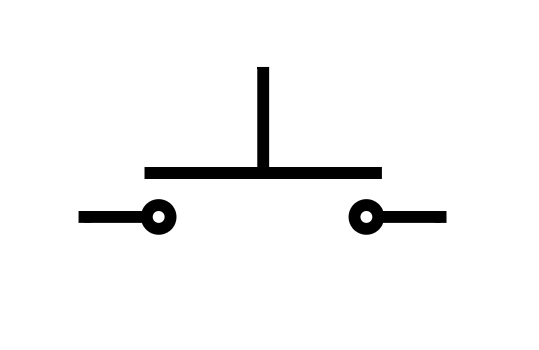
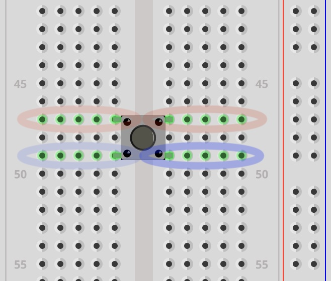
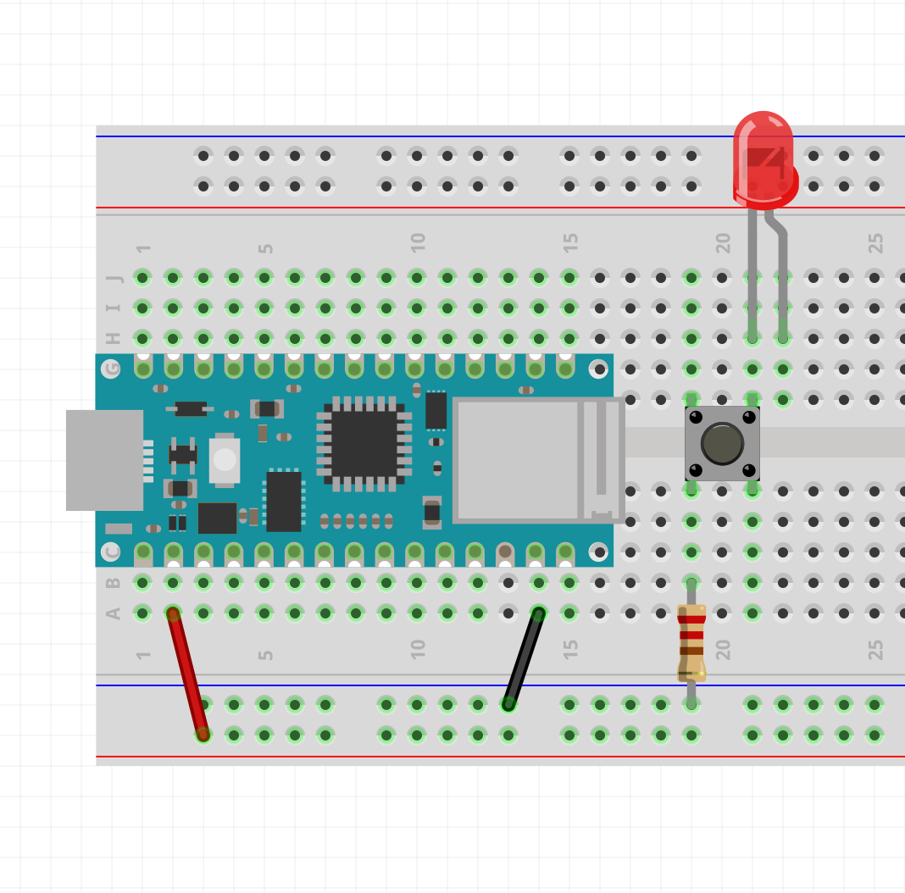
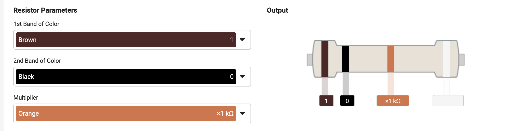
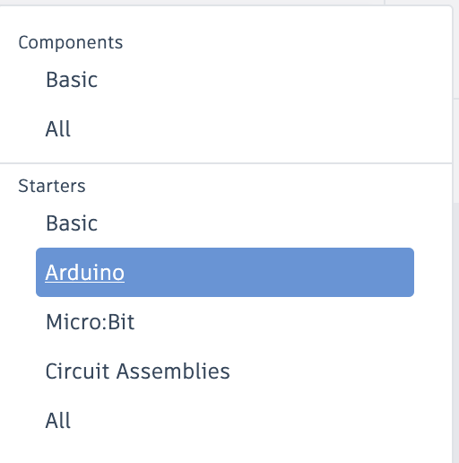
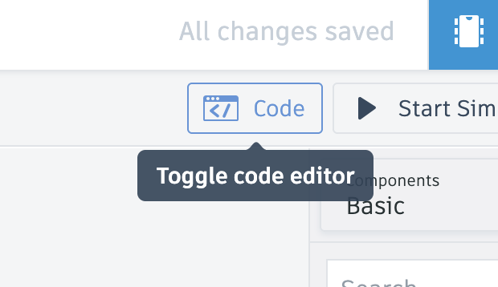
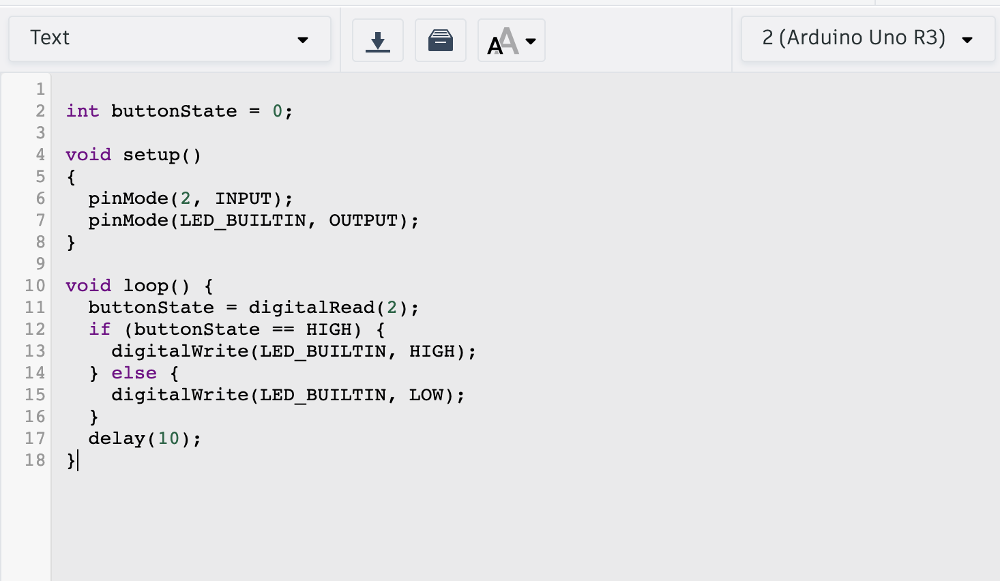
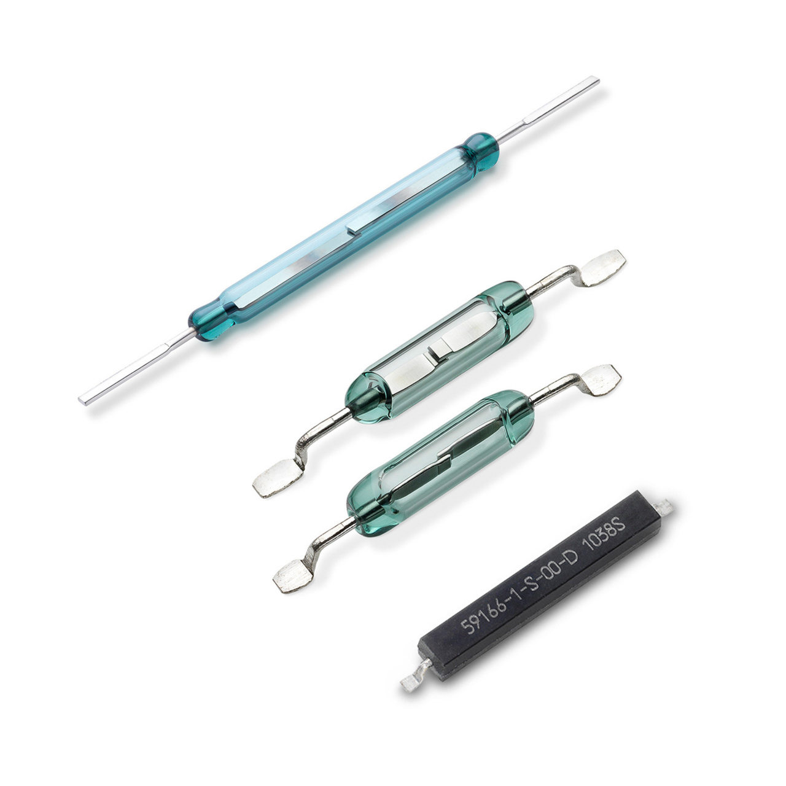
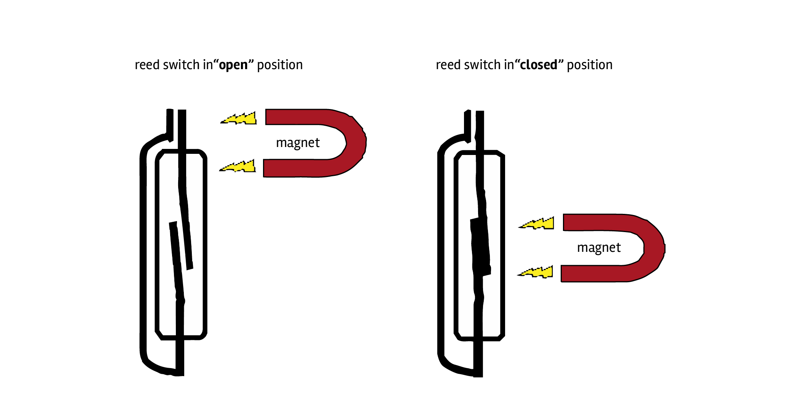

# Button

## How does a button work?

The button is just a simple way of completing or breaking a circuit with the simple act of "pushing" or "pressing" a button.

You could just manually join or unjoin two bare wires together with your hands to do this, but a button is a convenient way to interface (interact) with a circuit.

Often electronics kits come with a cheap tactile button that looks like this:

<div>
</img>
</div>

But it can take many forms and sizes.

<div>
</img>
</div>

Take a look at <a href="https://teenage.engineering/">Teenage Engineering</a>'s pocket operator products that use a similar looking tactile button.

<iframe style="background: black; margin-top:25px; margin-bottom:25px;" src="https://player.vimeo.com/video/935417234?h=6ec9ce8838?autoplay=1&loop=1" width="1920" height="1080" allowfullscreen uk-responsive uk-video="automute: true; autoplay: true; loop: true"></iframe>
And a case that would cover the look of those buttons:

<div>
</img>
</div>

---

## Pinout

### Switches

First it might help to explain that a button is essentially a push **switch**.

The schematic symbol for a generic switch is intuitive. It represents a wire that is either broken or not broken. 

The following shows a switch symbol that shows that it is **open**. Current _CANNOT_ pass through the wire.

<div>
</img>
</div>

This symbol shows the switch **closed**, meaning that the circuit is not broken. Current _CAN_ pass through the wire.

<div>
</img>
</div>

This is how an On-Off switch works. It is a **toggle** switch.

<div>
</img>
</div>


### Toggle vs. Push

Try interacting with the switch in this simulation showing a simple led-resistor circuit with a generic switch. (You may need to click the "RUN / Stop" button)

<iframe style="padding-top:25px;" id="circuitFrame" src="../../CircuitJS/circuitjs.html?ctz=CQAgjCAMB0l3BWcMBMcUHYMGZIA4UA2ATmIxAUgoqoQFMBaMMAKADcRsEUQAWOTtxBo8UMf2pUp0BCwDOgniIoZCw-GKoAzAIYAbOXRZhCPBKvWjza-lR4ATOroCuegC4M9de+E1RYrABOKjYCXDy2YmDwLEA" width="800" height="550" uk-responsive></iframe>

The next simulation is using a push switch instead (push button). Notice the difference.

<iframe style="padding-top:25px;" id="circuitFrame" src="../../CircuitJS/circuitjs.html?ctz=CQAgjCAMB0l3BWcMBMcUHYMGZIA4UA2ATmIxAUgoqoQFMBaMMAKADcRsEUQAWOTtxBo8UMf2pUp0BCzCEeCDIWH4KyvgJ4ATOgDMAhgFcANgBcGJutvBjpkVgCd1K-lS483YsPBYBnQR4RF1VRKggzRyM6FiA
" width="800" height="550" uk-responsive></iframe>

As you can see, the circuit is complete ONLY so long as the button is pressed. It is a **momentary** switch.

The schematic symbol for a push button looks a bit different but makes sense when you think about it.

<div>
</img>
</div>

The two wires on the left and right are connected when the plate above them is pushed down.

<div>
</img>
</div>

### The button legs

The button has 4 pins which makes this a bit confusing. It's still a single switch, but both sides of the 'wire' are accessible through a pair of legs instead of one.

<div>
</img>
</div>

<span><p style="text-align:center; color: #aeaeae"><i>illustration from makeabilitylab showing the internally connected legs</i></p></span>

Below is a screenshot in Fritzing to show that the pins in red are connected whether the button is pressed or not. Same with the blue pins. They are **internally connected**.

<div>
</img>
</div>

This means that when you press the button, the red and blue pins are connected together. It might seem hard to orient the button to know which pins are internally connected. If you extend the legs as if the button was a squished bug on a flat surface, the legs point away from the button. The legs that follow the same line are internally connected. It should also look like an 'H' or part of a railroad track.

The makeability blog post on [buttons](https://makeabilitylab.github.io/physcomp/arduino/buttons.html) is pretty good in explaining this.

---

## Circuit Demonstration

Let's do a circuit that turns an LED on when we press the button without any programming.

<div>
</img>
</div>

First I connect the button so that it crosses over the middle of the breadboard. It might be easier to think of this middle line as a river, and the button as a bridge. Also notice that with the legs extended they resemble more like a bridge.

Next I placed an LED on one side of the button, with one leg (the cathode) connected to the right side of the bridge.

On the left side of the bridge I placed the current limiting resistor for the LED. This is connected to ground.

<div>
</img>
</div>

The last step would be to connect the positive rail to the <span style="color:red">**anode**</span>.

Pressing the button should now light up the LED. This is because when you press the button, you are **completing the circuit**. When you release, you are **breaking** the circuit.

<div>
</img>
</div>

By the way, because we have power going through each side of the power rails, an alternative way of wiring this is like this:

<div>
</img>
</div>

Do you see why this completes the circuit?

---

## The Button Sketch

Go to:

**File** > **Examples** > **02.Digital** > **Button**

This is `Button.ino`.

Of course we should always look at the link provided in the block comment:

```txt
https://www.arduino.cc/en/Tutorial/BuiltInExamples/Button
```

<div>
</img>
</div>

It is using the UNO, but the wiring is pretty much the same.

We are connecting one side of the switch to (+) (In our case, 3.3V).

<div>
</img>
</div>

And the other side to a 10k ohm Resistor.

<blockquote class="warning">
<span class="uk-label uk-label-warning">Warning</span>
<p>The following images show a resistor with color bands of a 220 ohm resistor, but it should be 10k.</p>
</blockquote>

<div>
</img>
</div>

<div>
</img>
</div>

This other side of the button is ALSO connected to digital pin 2.

<div>
</img>
</div>

Lastly, the other side of the resistor is connected to **Ground**.

<div>
</img>
</div>

Pressing the button should turn on the built-in LED. You can confirm this by connecting an LED to pin 13 like how we did in the _Blink_ example. The LED will only be on so long as the button is PRESSED.

### Pull-Down Resistor

So why is there a 10k resistor in the wiring diagram? This is called a **pull-down resistor**. It won't make complete sense now, but the resistor is "pulling down" the input to a steady state of LOW or 0V. Without it, the input is unreliable.

Again, [makeabilitylab](https://makeabilitylab.github.io/physcomp/arduino/buttons.html) does a good explanation of this and **pull-up** resistors.

### In TinkerCAD

In TinkerCAD, it comes with some premade circuits with the Arduino Code.

You can find it in the dropbar menu on the right hand side:

<div>
</img>
</div>

This is the Button example:

<div>
</img>
</div>

Redrawn to fit in a breadboard like we did with the Nano:

<div>
</img>
</div>

To find the code editor:

<div>
</img>
</div>

The first thing you will see is a block code editor similar to the [Scratch Programming Language](https://scratch.mit.edu/).

<div>
</img>
</div>

To go to the text version of the code, like what we would see in the Arduino IDE. Select "Text" from this dropbar menu:

<div>
</img>
</div>

You can enter the **Button** example here: 

<div>
</img>
</div>

And click "Start Simulation" to see if it works by pushing the button.

### Sketch Breakdown

#### Constants

In this sketch we have two statements that introduce a new keyword called `const`.

```c
const int buttonPin = 2;  // the number of the pushbutton pin
const int ledPin = 13;    // the number of the LED pin
```

`const int buttonPin` means that `buttonPin` will remain **constant** and it is of type `int`. It is not a variable because in no moment will it change in the duration of the program running. It is a **constant**, not a variable.

The advantage of doing this is for readability and the way the board handles it is different. The IDE will also throw out an error if you try to change `buttonPin`, for example.

Next, we have an actual variable called `buttonState` that will hold the value of the button state (Is it pressed or not? `HIGH` or `LOW`?).

#### setup()

In the `setup()` function, everything should be straightforward. `ledPin` (_13_) is configured as an `OUTPUT`, and `buttonPin` (_2_) is configured as an `INPUT`.

```c
void setup() {
    // initialize the LED pin as an output:
    pinMode(ledPin, OUTPUT);
    // initialize the pushbutton pin as an input:
    pinMode(buttonPin, INPUT);
}
```

#### loop()

The first thing we do in the `loop()`, is to read the state of the push button by using the function `digitalRead()`.

##### digitalRead()

```c
// read the state of the pushbutton value:
buttonState = digitalRead(buttonPin);
```

`digitalRead()` only takes one parameter, the pin number that is being used as an input.

#### if statements, conditional statements

The remaining part of the `loop()` introduces something called a **conditional statement**.

```c
if (buttonState == HIGH) {
    // turn LED on:
    digitalWrite(ledPin, HIGH);
} else {
    // turn LED off:
    digitalWrite(ledPin, LOW);
}
```

This block of code translated to english is this:

**If** <span style="color: blue;">button is pressed</span> (buttonState is `HIGH`), _then_ <span style="color: blue">turn the led on</span> (`HIGH`),

**else** <span style="color: blue;">if it is NOT pressed</span> (buttonState is NOT `HIGH`), _then_ <span style="color: blue;">turn the led off</span> (`LOW`)

**If** the condition in the parentheses is TRUE, then it does everything inside the following curly brackets. **else** is the exception case. If it is not TRUE, then it must be FALSE, and everything in the last curly brackets is done.

This is the condition that is checked:
```
buttonState == HIGH
```

The double equals sign (`==`) means `equals to`. If buttonState `equals to` HIGH, then... do this -> { }

This is different from the single equal sign (`=`) that is used to assign a variable a value. A single `=` does not mean `equals to`, it means `is assigned the value of..`.

We will explore **if statements** more in the next exercise: [Dice Roller Challenge](../dice_roller/dice_roller.html)

<ul uk-accordion style='pading-bottom: 5vh'> <li class='uk-open'>
<a id='code-file' class='uk-accordion-title' href='#'>Button (Full Sketch)</a>
<div class='uk-accordion-content' style='padding-bottom:20px; margin-bottom:20px'>

```c
// constants won't change. They're used here to set pin numbers:
const int buttonPin = 2;  // the number of the pushbutton pin
const int ledPin = 13;    // the number of the LED pin

// variables will change:
int buttonState = 0;  // variable for reading the pushbutton status

void setup() {
    // initialize the LED pin as an output:
    pinMode(ledPin, OUTPUT);
    // initialize the pushbutton pin as an input:
    pinMode(buttonPin, INPUT);
}

void loop() {
    // read the state of the pushbutton value:
    buttonState = digitalRead(buttonPin);

    // check if the pushbutton is pressed. If it is, the buttonState is HIGH:
    if (buttonState == HIGH) {
        // turn LED on:
        digitalWrite(ledPin, HIGH);
    } else {
        // turn LED off:
        digitalWrite(ledPin, LOW);
    }
}
```

</div>

---

## Misc. Switches

There are other types of switches that are worth mentioning.

### Tilt Switch

<div>
</img>
</div>

A tilt switch is a switch that completes the circuit depending on its orientation to the force of gravity.

<div>
</img>
</div>

The thing inside could be a metallic ball or a bit of mercury.

### Reed Switch

<div>
</img>
</div>

A reed switch closes when a magnet is near it.

<div>
</img>
</div>

## Terminology

- constants (`const`)
- digitalRead()
- pull-down and pull-up resistors
- momentary vs toggle switch
- conditional statements (`if`, `else`)
- `==` vs `=`, `equals to` vs. `is assigned the value of`
- internally connected legs
