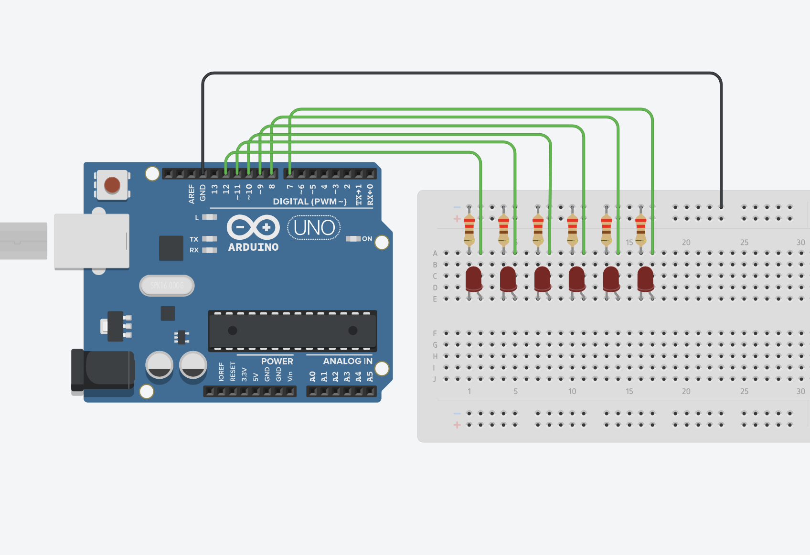
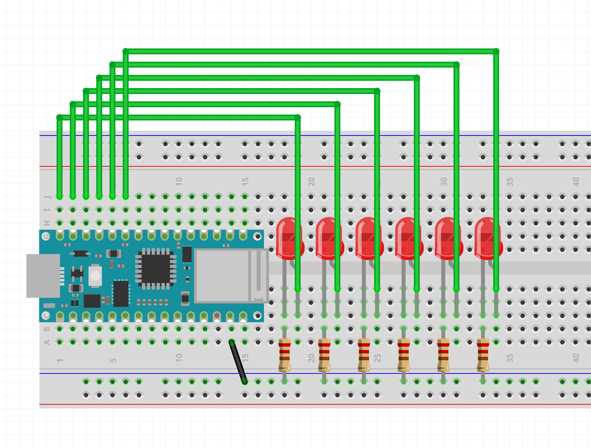
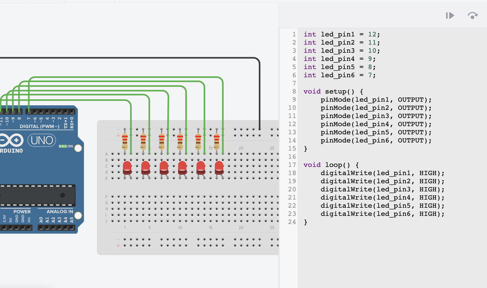
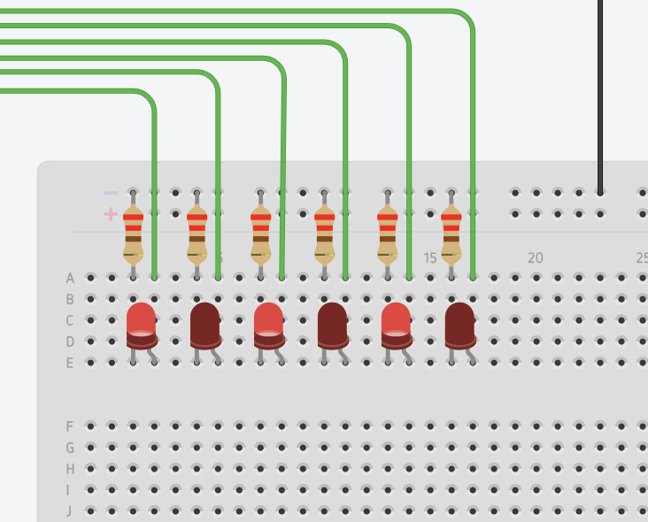
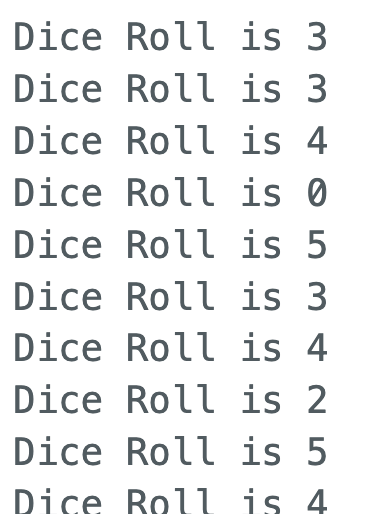

# Dice Roller

## Background

<iframe style="background: black; margin-top:25px; margin-bottom:25px;" src="https://www.youtube-nocookie.com/embed/Q2bSSRIU0WQ?autoplay=0&amp;showinfo=0&amp;rel=0&amp;modestbranding=1&amp;playsinline=1" width="1920" height="1080" allowfullscreen uk-responsive uk-video="automute: true; autoplay: false"></iframe>

A popular analog electronics challenge is to make an electronic LED dice roller using **Integrated Circuits** (ICs) like a **555 timer** and a **CD4017 counter** to "roll the dice" by counting quickly through a range of numbers. Both of these together act somewhat like a `random()` function. The timer acts as an oscillator that cycles through each number possibility so fast that it is impossible to know what it will land on.

Seen for some as a rite of passage for electronics tinkerers, we can create a simple version of a dice roller with the Arduino using what we already know.

So far we know how to:

- Hook up any number of LED outputs (We have a max number of 22 I/O pins). A dice has 6 possibilities. So we can use 6 LED digital outputs using `digitalWrite()` to represent each possibility.
- Hooking up and reading from a button input using `digitalRead()`.
- Using the `random()` function to get a random number to select from 6 possible outcomes.

## Wiring the LEDs

Let's start with wiring the 6 LEDs.

<div>
</img>
</div>

<span><p style="text-align:center; color: #aeaeae"><i>6 LED outputs with Uno in TinkerCAD</i></p></span>

<div>
</img>
</div>

<span><p style="text-align:center; color: #aeaeae"><i>6 LED outputs with Nano in Fritzing</i></p></span>

In these images I hooked up LEDs to pins 7 to 12.

```c
const int led_pin1 = 12;
const int led_pin2 = 11;
const int led_pin3 = 10;
const int led_pin4 = 9;
const int led_pin5 = 8;
const int led_pin6 = 7;

void setup() {
    pinMode(led_pin1, OUTPUT);
    pinMode(led_pin2, OUTPUT);
    pinMode(led_pin3, OUTPUT);
    pinMode(led_pin4, OUTPUT);
    pinMode(led_pin5, OUTPUT);
    pinMode(led_pin6, OUTPUT);
}

void loop() {
    digitalWrite(led_pin1, HIGH);
    digitalWrite(led_pin2, HIGH);
    digitalWrite(led_pin3, HIGH);
    digitalWrite(led_pin4, HIGH);
    digitalWrite(led_pin5, HIGH);
    digitalWrite(led_pin6, HIGH);
}
```

To test that all LEDs work we can manually set the state of all the used pins to `HIGH` to light them all up.

<div>
</img>
</div>

Again we can alternate the states to make sure that they do what we expect them to do.

```c
void loop() {
    digitalWrite(led_pin1, HIGH);
    digitalWrite(led_pin2, LOW);
    digitalWrite(led_pin3, HIGH);
    digitalWrite(led_pin4, LOW);
    digitalWrite(led_pin5, HIGH);
    digitalWrite(led_pin6, LOW);
}
```

<div>
</img>
</div>

## Adding randomness and using the Serial Monitor

Now that we have LEDs. Let's try to randomly light up only one of the LEDs on every loop cycle.

First I will set aside the previous code with the LEDs for now to isolate just the randomness part.

We can create a variable called `dice_roll` that will hold the value of our 'generated' random number. We can simply declare it without giving it an initial value.

```c
int dice_roll;
```

<blockquote class="info">
<span class="uk-label">Note</span>
<p>A variable of type **int** when not given an initial value is by default the value of 0.</p>
</blockquote>

Next, within the `loop()` function, we can assign this variable a new random number each time the loop function runs.

```c
void loop() {
    dice_roll = random(6);
}
```

It would be nice to see each new random number. We can use the Serial Monitor for that. To start the use of the Serial Monitor we use `Serial.begin(9600)` in the `setup()` function.

```c
void setup() {
    Serial.begin(9600);
}
```

To print the value of `dice_roll`, we use `Serial.println()`.

```c
int dice_roll = 0;

void setup() {
    Serial.begin(9600);
}

void loop() {
    dice_roll = random(6);

    // print the value of dice_roll to Serial Monitor
    Serial.println(dice_roll);
}
```

The last thing would be to add a `delay()` so that it prints and generates a new number after a certain amount of time. Let's say it should print a random number every second.

```c
delay(1000);
```

<ul uk-accordion style='pading-bottom: 5vh'> <li class='uk-close'>
<a id='code-file' class='uk-accordion-title' href='#'>Print Random Value to Serial Monitor</a>
<div class='uk-accordion-content' style='padding-bottom:20px; margin-bottom:20px'>

```c
int dice_roll = 0;

void setup() {
    Serial.begin(9600);
}

void loop() {
    dice_roll = random(6);

    // print the value of dice_roll to Serial Monitor
    Serial.println(dice_roll);

    // add a delay so that it prints only after every second
    delay(1000);
}
```

What we should be seeing in the Serial Monitor is something like this:

<div>
</img>
</div>

<span><p style="text-align:center; color: #aeaeae"><i>Printing Values 0-5</i></p></span>

</div>

---

## If Statements

Before we can combine both ideas together, we need to figure out the logic needed to make 6 different things happen depending on the result of `random()`.

We need to use **if statements**, or **conditional statements**, which were introduced in the `button` example.

**If statements** look a little similar to functions:

```c
if (condition) {
    // code in here is executed if condition is TRUE

}
```

Anything in the curly brackets is considered to be in that `if statement`, and only happens if the condition is `TRUE`.

For example:

- `if` **(** the dice_roll value is equal to 1 **)** `then` **{** light up led_pin1 **}**
- `if` **(** the dice_roll value is equal to 2 **)** `then` **{**light up led_pin2 **}**

and so on.

We can start testing this by adding this statement and seeing the result in the Serial Monitor:

```c
if (dice_roll == 0) {
    Serial.print("Dice Roll is 0");
}

```

Let's test.

```c
int dice_roll = 0;

void setup() {
    Serial.begin(9600);
}

void loop() {
    dice_roll = random(6);

    if (dice_roll == 0) {
        Serial.println("Dice Roll is 0");
    }

    // print the value of dice_roll to Serial Monitor
    Serial.println(dice_roll);

    // add a delay so that it prints only after every second
    delay(1000);
}
```

<div>
</img>
</div>

We can also add an `else{}` after the `if(){}` in the case that we want it to do something if the condition is NOT true or FALSE:

```c
int dice_roll = 0;

void setup() {
    Serial.begin(9600);
}

void loop() {
    dice_roll = random(6);

    if (dice_roll == 0) {
        Serial.println("Dice Roll is 0");
    } else {
      Serial.println("Dice Roll is NOT 0");
    }

    // print the value of dice_roll to Serial Monitor
    Serial.println(dice_roll);

    // add a delay so that it prints only after every second
    delay(1000);
}
```

<div>
</img>
</div>

Another thing we can do is add more conditions to check with `else if`:

```c
void loop() {
    dice_roll = random(6);

    if (dice_roll == 0) {
        Serial.println("Dice Roll is 0");
    } else if (dice_roll == 1) {
        Serial.println("Dice Roll is 1");
    } else {
        Serial.println("Not 0 or 1");
    }
}
```

We can do this for each of the 6 possibilities. I will also take out the `else{}` because we know that dice_roll can only be 6 possibilities.

```c
void loop() {
    dice_roll = random(6);

    if (dice_roll == 0) {
        Serial.println("Dice Roll is 0");
    } else if (dice_roll == 1) {
        Serial.println("Dice Roll is 1");
    } else if (dice_roll == 2) {
        Serial.println("Dice Roll is 2");
    } else if (dice_roll == 3) {
        Serial.println("Dice Roll is 3");
    } else if (dice_roll == 4) {
        Serial.println("Dice Roll is 4");
    } else if (dice_roll == 5) {
        Serial.println("Dice Roll is 5");
    }

    // pause for 1 second
    delay(1000)
}
```

Results:

<div>
</img>
</div>

## Randomly Light up One LED

Now we can combine all ideas together.

We can simply replace all the `Serial.println()` lines with `digitalWrite()`, declare each led_pin `const`, and configure them as outputs:

```c
int dice_roll = 0;

const int led_pin1 = 12;
const int led_pin2 = 11;
const int led_pin3 = 10;
const int led_pin4 = 9;
const int led_pin5 = 8;
const int led_pin6 = 7;

void setup() {
    Serial.begin(9600);

    pinMode(led_pin1, OUTPUT);
    pinMode(led_pin2, OUTPUT);
    pinMode(led_pin3, OUTPUT);
    pinMode(led_pin4, OUTPUT);
    pinMode(led_pin5, OUTPUT);
    pinMode(led_pin6, OUTPUT);
}

void loop() {
    dice_roll = random(6);

    if (dice_roll == 0) {
        digitalWrite(led_pin1, HIGH);
    } else if (dice_roll == 1) {
        digitalWrite(led_pin2, HIGH);
    } else if (dice_roll == 2) {
        digitalWrite(led_pin3, HIGH);
    } else if (dice_roll == 3) {
        digitalWrite(led_pin4, HIGH);
    } else if (dice_roll == 4) {
        digitalWrite(led_pin5, HIGH);
    } else if (dice_roll == 5) {
        digitalWrite(led_pin6, HIGH);
    }

    // add a delay so that it prints only after every second
    delay(1000);
}
```

Uploading this code reveals a problem. LEDs start to light up one by one but they never turn off. 

This is because when one light gets selected and turns on, nothing is telling the Arduino to turn all the other LEDs off.

We need to reset all the LEDs back to `LOW` state each time.

```c
int dice_roll = 0;

int led_pin1 = 12;
int led_pin2 = 11;
int led_pin3 = 10;
int led_pin4 = 9;
int led_pin5 = 8;
int led_pin6 = 7;

void setup() {
  Serial.begin(9600);

  pinMode(led_pin1, OUTPUT);
  pinMode(led_pin2, OUTPUT);
  pinMode(led_pin3, OUTPUT);
  pinMode(led_pin4, OUTPUT);
  pinMode(led_pin5, OUTPUT);
  pinMode(led_pin6, OUTPUT);
}

void loop() {
  dice_roll = random(6);

  if (dice_roll == 0) {
    digitalWrite(led_pin1, HIGH);
  } else if (dice_roll == 1) {
    digitalWrite(led_pin2, HIGH);
  } else if (dice_roll == 2) {
    digitalWrite(led_pin3, HIGH);
  } else if (dice_roll == 3) {
    digitalWrite(led_pin4, HIGH);
  } else if (dice_roll == 4) {
    digitalWrite(led_pin5, HIGH);
  } else if (dice_roll == 5) {
    digitalWrite(led_pin6, HIGH);
  }

  // turn on for one second
  delay(1000);

  // reset LEDs
  digitalWrite(led_pin1, LOW);
  digitalWrite(led_pin2, LOW);
  digitalWrite(led_pin3, LOW);
  digitalWrite(led_pin4, LOW);
  digitalWrite(led_pin5, LOW);
  digitalWrite(led_pin6, LOW);
}
```

Uploading this code shows that it works just how we wanted. Every second a random LED lights up. Change the delay to something like `40` to see how fast it can go.

## The Challenge

See if you can combine the previous LED sketch with the button sketch. The goal is to get one random LED to light up every time you press and release the button. When you release the button, the picked LED should remain ON.

To start planning how to tackle the problem, it is good to start thinking in **pseudo code**.

**if** the button is PRESSED, get a new random number.

**if** the button is NOT PRESSED, the corresponding LED should be on.

Lets write the last two sentences in another way.

**if** the button is HIGH, _then_ get a new random number,

```c
if (buttonState == HIGH) {
    dice_roll = random(6);
}
```

**else** don't get a new random number and just light up the corresponding LED.


```c
else {
    digitalWrite(picked_led, HIGH);
}
```

All together:

```c
buttonState = digitalRead(button_pin);

if (buttonState == HIGH) {
    dice_roll = random(6);
} else {
    digitalWrite(picked_led, HIGH);
}
```

As we get closer and closer to actual code, we notice that `picked_led` runs us into a problem. How do we get the corresponding LED output pins that go from 7-12 when the random numbers go from 0-5?

There are actually many ways to solve this. We could potentially just use digital pins 0 - 5, but that is impractical. We could instead change the random numbers to not be of range 0 - 5, but of 7 - 12.

### Use random() min and max value

`random()` can take two parameters. If you provide two parameters, the first one will be the `min` and the second will be the `max`. So instead of starting from 0, it can start from the `min` and up to but not including the `max` number.

`random(7, 13)`: will give us the range 7 - 12.

So the solution to our earlier pseudo code would be this:

```c
if (buttonState == HIGH) {
    dice_roll = random(7, 13);
} else {
    digitalWrite(dice_roll, HIGH);
}
```

It might be easier to understand if we rename `dice_roll` to `picked_led`.

```c
if (buttonState == HIGH) {
    picked_led = random(7, 13);
} else {
    digitalWrite(picked_led, HIGH);
}
```

If we reset the LEDs to turn off at the end of the loop like we did before:

```c
void loop() {
    buttonState = digitalRead(button_pin);

    if (buttonState == HIGH) {
        picked_led = random(7, 13);
    } else {
        digitalWrite(picked_led, HIGH);
    }

    // reset LEDs
    digitalWrite(led_pin1, LOW);
    digitalWrite(led_pin2, LOW);
    digitalWrite(led_pin3, LOW);
    digitalWrite(led_pin4, LOW);
    digitalWrite(led_pin5, LOW);
    digitalWrite(led_pin6, LOW);
}
```

And then when we add the rest we should have something like this. Uploading it and testing it shows that it works just as described.

<ul uk-accordion style='pading-bottom: 5vh'> <li class='uk-open'>
<a id='code-file' class='uk-accordion-title' href='#'>Solution 1</a>
<div class='uk-accordion-content' style='padding-bottom:20px; margin-bottom:20px'>

```c
int picked_led = 0;
int buttonState = 0;

const int button_pin = 2;

const int led_pin1 = 12;
const int led_pin2 = 11;
const int led_pin3 = 10;
const int led_pin4 = 9;
const int led_pin5 = 8;
const int led_pin6 = 7;

void setup() {
    pinMode(button_pin, INPUT);
    pinMode(led_pin1, OUTPUT);
    pinMode(led_pin2, OUTPUT);
    pinMode(led_pin3, OUTPUT);
    pinMode(led_pin4, OUTPUT);
    pinMode(led_pin5, OUTPUT);
    pinMode(led_pin6, OUTPUT);
}

void loop() {
    buttonState = digitalRead(button_pin);

    if (buttonState == HIGH) {
        picked_led = random(7, 13);
    } else {
        digitalWrite(picked_led, HIGH);
    }

    // reset LEDs
    digitalWrite(led_pin1, LOW);
    digitalWrite(led_pin2, LOW);
    digitalWrite(led_pin3, LOW);
    digitalWrite(led_pin4, LOW);
    digitalWrite(led_pin5, LOW);
    digitalWrite(led_pin6, LOW);
}
```

</div>

It is not very noticeable, but you might notice that some LEDs vary in brightness. Some are dimmer than others. This is because even the `picked_led` is being turned off at the end of every loop. Ideally, the `picked_led` should just have a `digitalWrite(picked_led, HIGH);` every loop.

We can do that by just moving the `// reset LEDs` section up within the `(buttonState == HIGH)` condition.

```c
void loop() {
    buttonState = digitalRead(button_pin);

    if (buttonState == HIGH) {
        picked_led = random(7, 13);

        // reset LEDs
        digitalWrite(led_pin2, LOW);
        digitalWrite(led_pin3, LOW);
        digitalWrite(led_pin4, LOW);
        digitalWrite(led_pin5, LOW);
        digitalWrite(led_pin6, LOW);
        digitalWrite(led_pin1, LOW);
    } else {
        digitalWrite(picked_led, HIGH);
    }
}
```

Now the selected LED will remain `HIGH` when the button is NOT pressed (`LOW` state).

Another nice improvement could be to animate it a little bit when the button is pressed by visualizing the randomness.

```c
void loop() {
    buttonState = digitalRead(button_pin);

    if (buttonState == HIGH) {
        picked_led = random(7, 13);

        // show random selections while pressed
        digitalWrite(picked_led, HIGH);
        delay(40);

        // reset LEDs
        digitalWrite(led_pin2, LOW);
        digitalWrite(led_pin3, LOW);
        digitalWrite(led_pin4, LOW);
        digitalWrite(led_pin5, LOW);
        digitalWrite(led_pin6, LOW);
        digitalWrite(led_pin1, LOW);
    } else {
        digitalWrite(picked_led, HIGH);
    }
}
```
