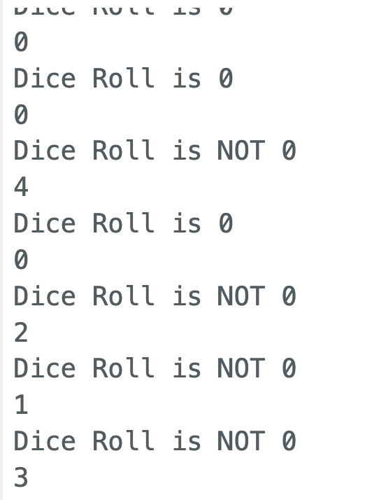

# Dice Roller

## Background

<iframe style="background: black; margin-top:25px; padding-bottom:25px;" src="https://www.youtube-nocookie.com/embed/Q2bSSRIU0WQ?autoplay=0&amp;showinfo=0&amp;rel=0&amp;modestbranding=1&amp;playsinline=1" width="1920" height="1080" allowfullscreen uk-responsive uk-video="automute: true; autoplay: false"></iframe>

A popular analog electronics challenge is to make an electronic LED dice roller using **Integrated Circuits** (ICs) like a **555 timer** and a **CD4017 counter** to "roll the dice" by counting quickly through a range of numbers. Both of these together act somewhat like a `random()` function. The timer acts as an oscillator that cycles through each number possibility so fast that it is impossible to know what it will land on.

Seen for some as a rite of passage for electronics tinkerers, we can create a simple version of a dice roller with the Arduino using what we already know.

So far we know how to:

- Hook up any number of LED outputs (We have a max number of 22 I/O pins). A dice has 6 possibilities. So we can use 6 LED digital outputs using `digitalWrite()` to represent each possibility.
- Hooking up and reading from a button input using `digitalRead()`.
- Using the `random()` function to get a random number to select from 6 possible outcomes.

## Wiring the LEDs

Let's start with wiring the 6 LEDs.

<div>
</img>
</div>

<span><p style="text-align:center; color: #aeaeae"><i>6 LED outputs with Uno in TinkerCAD</i></p></span>

<div>
</img>
</div>

<span><p style="text-align:center; color: #aeaeae"><i>6 LED outputs with Nano in Fritzing</i></p></span>

In these images I hooked up LEDs to pins 7 to 12.

```c
int led_pin1 = 12;
int led_pin2 = 11;
int led_pin3 = 10;
int led_pin4 = 9;
int led_pin5 = 8;
int led_pin6 = 7;

void setup() {
    pinMode(led_pin1, OUTPUT);
    pinMode(led_pin2, OUTPUT);
    pinMode(led_pin3, OUTPUT);
    pinMode(led_pin4, OUTPUT);
    pinMode(led_pin5, OUTPUT);
    pinMode(led_pin6, OUTPUT);
}

void loop() {
    digitalWrite(led_pin1, HIGH);
    digitalWrite(led_pin2, HIGH);
    digitalWrite(led_pin3, HIGH);
    digitalWrite(led_pin4, HIGH);
    digitalWrite(led_pin5, HIGH);
    digitalWrite(led_pin6, HIGH);
}
```

To test that all LEDs work we can manually set the state of all the used pins to `HIGH` to light them all up.

<div>
</img>
</div>

Again we can alternate the states to make sure that they do what we expect them to do.

```c
void loop() {
    digitalWrite(led_pin1, HIGH);
    digitalWrite(led_pin2, LOW);
    digitalWrite(led_pin3, HIGH);
    digitalWrite(led_pin4, LOW);
    digitalWrite(led_pin5, HIGH);
    digitalWrite(led_pin6, LOW);
}
```

<div>
</img>
</div>

## Adding randomness and using the Serial Monitor

Now that we have LEDs. Let's try to randomly light up only one of the LEDs on every loop cycle.

First I will set aside the previous code with the LEDs for now to isolate just the randomness part.

We can create a variable called `dice_roll` that will hold the value of our generated random number. We can initialize it with a value of 0.

```c
int dice_roll = 0;
```

Next, within the `loop()` function, we can assign this variable a new random number each time the loop function runs.

```c
void loop() {
    dice_roll = random(6);
}
```

It would be nice to see each new random number. We can use the Serial Monitor for that. To start the use of the Serial Monitor we use `Serial.begin(9600)` in the `setup()` function.

```c
void setup() {
    Serial.begin(9600);
}
```

To print the value of `dice_roll`, we use `Serial.println()`.

```c
int dice_roll = 0;

void setup() {
    Serial.begin(9600);
}

void loop() {
    dice_roll = random(6);

    // print the value of dice_roll to Serial Monitor
    Serial.println(dice_roll);
}
```

The last thing would be to add a `delay()` so that it prints and generates a new number after a certain amount of time. Let's say it should print a random number every second.

```c
delay(1000);
```

<ul uk-accordion style='pading-bottom: 5vh'> <li class='uk-close'>
<a id='code-file' class='uk-accordion-title' href='#'>Print Random Value to Serial Monitor</a>
<div class='uk-accordion-content' style='padding-bottom:20px; margin-bottom:20px'>

```c
int dice_roll = 0;

void setup() {
    Serial.begin(9600);
}

void loop() {
    dice_roll = random(6);

    // print the value of dice_roll to Serial Monitor
    Serial.println(dice_roll);

    // add a delay so that it prints only after every second
    delay(1000);
}
```

What we should be seeing in the Serial Monitor is something like this:

<div>
</img>
</div>

<span><p style="text-align:center; color: #aeaeae"><i>Printing Values 0-5</i></p></span>

</div>

---

## If Statements

Before we can combine both ideas together, we need to introduce something called **if statements**, or **conditional statements**.

If statements look a little similar to functions:

```c
if (condition) {
    // code in here is executed if condition is TRUE

}
```

Anything in the curly brackets is considered to be in that `if statement`, and only executes if the condition is `TRUE`.

For example:

- if the dice_roll value is equal to 1 -> light up led_pin1
- if the dice_roll value is equal to 2 -> light up led_pin2
- and so on

We can start with testing in the Serial Monitor:

```c
if (dice_roll == 0) {
    Serial.print("Dice Roll is 0");
}

```

This conditon `if (dice_roll == 0)` translates to english as: "If dice_roll value is 0, then ... {print 'Dice Roll is 0'}".

Let's test.

```c
int dice_roll = 0;

void setup() {
    Serial.begin(9600);
}

void loop() {
    dice_roll = random(6);

    if (dice_roll == 0) {
        Serial.println("Dice Roll is 0");
    }

    // print the value of dice_roll to Serial Monitor
    Serial.println(dice_roll);

    // add a delay so that it prints only after every second
    delay(1000);
}
```

<div>
</img>
</div>

We can also add an `else{}` after the `if(){}` in the case that we want it to do something if the condition is NOT true or FALSE:

```c
int dice_roll = 0;

void setup() {
    Serial.begin(9600);
}

void loop() {
    dice_roll = random(6);

    if (dice_roll == 0) {
        Serial.print("Dice Roll is 0");
    } else {
        // print the value of dice_roll to Serial Monitor
        Serial.println(dice_roll);
    }

    // add a delay so that it prints only after every second
    delay(1000);
}
```

<div>
</img>
</div>

Another thing we can do is add more conditions to check with `else if`:

```c
void loop() {
    dice_roll = random(6);

    if (dice_roll == 0) {
        Serial.println("Dice Roll is 0");
    } else if (dice_roll == 1) {
        Serial.println("Dice Roll is 1");
    } else {
        Serial.println("Not 2 or 0");
    }
}
```

We  can do this for each of the 6 (or 7) possibilities.

```c
void loop() {
    dice_roll = random(6);

    if (dice_roll == 0) {
        Serial.println("Dice Roll is 0");
    } else if (dice_roll == 1) {
        Serial.println("Dice Roll is 1");
    } else if (dice_roll == 2) {
        Serial.println("Dice Roll is 2");
    } else if (dice_roll == 3) {
        Serial.println("Dice Roll is 3");
    } else if (dice_roll == 4) {
        Serial.println("Dice Roll is 4");
    } else if (dice_roll == 5) {
        Serial.println("Dice Roll is 5");
    } else {
        Serial.println("Not in range");
    }
}
```

This block translates to english as: "if dice_roll value is 0, print 'Dice Roll is 0', else if dice_roll value is 1, print 'Dice Roll is 1. ... and so on".

<div>
</img>
</div>

## Randomly Light up One LED

Now we can combine all ideas together.

We can simply replace all the `Serial.println()` lines with `digitalWrite()` lines:

```c
int dice_roll = 0;

int led_pin1 = 12;
int led_pin2 = 11;
int led_pin3 = 10;
int led_pin4 = 9;
int led_pin5 = 8;
int led_pin6 = 7;

void setup() {
    Serial.begin(9600);

    pinMode(led_pin1, OUTPUT);
    pinMode(led_pin2, OUTPUT);
    pinMode(led_pin3, OUTPUT);
    pinMode(led_pin4, OUTPUT);
    pinMode(led_pin5, OUTPUT);
    pinMode(led_pin6, OUTPUT);
}

void loop() {
    dice_roll = random(6);

    if (dice_roll == 0) {
        digitalWrite(led_pin1, HIGH);
    } else if (dice_roll == 1) {
        digitalWrite(led_pin2, HIGH);
    } else if (dice_roll == 2) {
        digitalWrite(led_pin3, HIGH);
    } else if (dice_roll == 3) {
        digitalWrite(led_pin4, HIGH);
    } else if (dice_roll == 4) {
        digitalWrite(led_pin5, HIGH);
    } else if (dice_roll == 5) {
        digitalWrite(led_pin6, HIGH);
    } else {
        Serial.println("Not in range");
    }

    // add a delay so that it prints only after every second
    delay(1000);
}
```

Uploading this code reveals a problem. LEDs start to light up one by one but they never turn off. When one light gets selected, we need to turn off all the remaining lights. 

For example, if `led_pin1` gets selected (`dice_roll == 0`), then what should happen is this:

```c
if (dice_roll == 0) {
    digitalWrite(led_pin1, HIGH);
    digitalWrite(led_pin2, LOW);
    digitalWrite(led_pin3, LOW);
    digitalWrite(led_pin4, LOW);
    digitalWrite(led_pin5, LOW);
    digitalWrite(led_pin6, LOW);
}

```

You would have to do that for every one of the 6 cases, which immediately looks tedious:

```c
int dice_roll = 0;

int led_pin1 = 12;
int led_pin2 = 11;
int led_pin3 = 10;
int led_pin4 = 9;
int led_pin5 = 8;
int led_pin6 = 7;

void setup() {
    Serial.begin(9600);
}

void loop() {
    dice_roll = random(6);

    pinMode(led_pin1, OUTPUT);
    pinMode(led_pin2, OUTPUT);
    pinMode(led_pin3, OUTPUT);
    pinMode(led_pin4, OUTPUT);
    pinMode(led_pin5, OUTPUT);
    pinMode(led_pin6, OUTPUT);

    if (dice_roll == 0) {
        digitalWrite(led_pin1, HIGH);
        digitalWrite(led_pin2, LOW);
        digitalWrite(led_pin3, LOW);
        digitalWrite(led_pin4, LOW);
        digitalWrite(led_pin5, LOW);
        digitalWrite(led_pin6, LOW);
    } else if (dice_roll == 1) {
        digitalWrite(led_pin2, HIGH);
        digitalWrite(led_pin1, LOW);
        digitalWrite(led_pin3, LOW);
        digitalWrite(led_pin4, LOW);
        digitalWrite(led_pin5, LOW);
        digitalWrite(led_pin6, LOW);
    } else if (dice_roll == 2) {
        digitalWrite(led_pin3, HIGH);
        digitalWrite(led_pin1, LOW);
        digitalWrite(led_pin2, LOW);
        digitalWrite(led_pin4, LOW);
        digitalWrite(led_pin5, LOW);
        digitalWrite(led_pin6, LOW);
    } else if (dice_roll == 3) {
        digitalWrite(led_pin4, HIGH);
        digitalWrite(led_pin1, LOW);
        digitalWrite(led_pin2, LOW);
        digitalWrite(led_pin3, LOW);
        digitalWrite(led_pin5, LOW);
        digitalWrite(led_pin6, LOW);
    } else if (dice_roll == 4) {
        digitalWrite(led_pin5, HIGH);
        digitalWrite(led_pin1, LOW);
        digitalWrite(led_pin2, LOW);
        digitalWrite(led_pin3, LOW);
        digitalWrite(led_pin4, LOW);
        digitalWrite(led_pin6, LOW);
    } else if (dice_roll == 5) {
        digitalWrite(led_pin6, HIGH);
        digitalWrite(led_pin1, LOW);
        digitalWrite(led_pin2, LOW);
        digitalWrite(led_pin3, LOW);
        digitalWrite(led_pin4, LOW);
        digitalWrite(led_pin5, LOW);
    } else {
        Serial.println("Not in range");
    }

    // add a delay so that it prints only after every second
    delay(1000);
}
```

Uploading this code shows that it works just how we wanted. Every second a random LED lights up, but the amount of lines of code quickly grew and became overwhelming.

## The Challenge

See if you can combine the previous LED sketch with the button sketch. The goal is to get one random LED to light up every time you press the button. To get started, you should look at the `StateChangeDetection` example sketch:

This is found under **File** -> **Examples** -> **02.Digital** -> **StateChangeDetection**

```c
/*
   State change detection (edge detection)

   Often, you don't need to know the state of a digital input all the time, but
   you just need to know when the input changes from one state to another.
   For example, you want to know when a button goes from OFF to ON. This is called
   state change detection, or edge detection.

   This example shows how to detect when a button or button changes from off to on
   and on to off.

   The circuit:
   - pushbutton attached to pin 2 from +5V
   - 10 kilohm resistor attached to pin 2 from ground
   - LED attached from pin 13 to ground through 220 ohm resistor (or use the
   built-in LED on most Arduino boards)

   created  27 Sep 2005
   modified 30 Aug 2011
   by Tom Igoe

   This example code is in the public domain.

   https://www.arduino.cc/en/Tutorial/BuiltInExamples/StateChangeDetection
 */

// this constant won't change:
const int buttonPin = 2;  // the pin that the pushbutton is attached to
const int ledPin = 13;    // the pin that the LED is attached to

// Variables will change:
int buttonPushCounter = 0;  // counter for the number of button presses
int buttonState = 0;        // current state of the button
int lastButtonState = 0;    // previous state of the button

void setup() {
    // initialize the button pin as a input:
    pinMode(buttonPin, INPUT);
    // initialize the LED as an output:
    pinMode(ledPin, OUTPUT);
    // initialize serial communication:
    Serial.begin(9600);
}


void loop() {
    // read the pushbutton input pin:
    buttonState = digitalRead(buttonPin);

    // compare the buttonState to its previous state
    if (buttonState != lastButtonState) {
        // if the state has changed, increment the counter
        if (buttonState == HIGH) {
            // if the current state is HIGH then the button went from off to on:
            buttonPushCounter++;
            Serial.println("on");
            Serial.print("number of button pushes: ");
            Serial.println(buttonPushCounter);
        } else {
            // if the current state is LOW then the button went from on to off:
            Serial.println("off");
        }
        // Delay a little bit to avoid bouncing
        delay(50);
    }
    // save the current state as the last state, for next time through the loop
    lastButtonState = buttonState;


    // turns on the LED every four button pushes by checking the modulo of the
    // button push counter. the modulo function gives you the remainder of the
    // division of two numbers:
    if (buttonPushCounter % 4 == 0) {
        digitalWrite(ledPin, HIGH);
    } else {
        digitalWrite(ledPin, LOW);
    }
}
```

