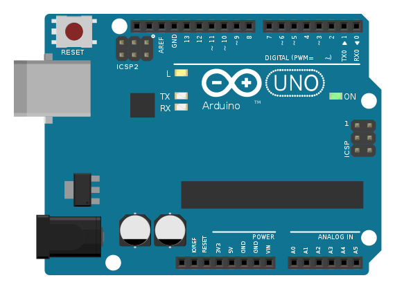
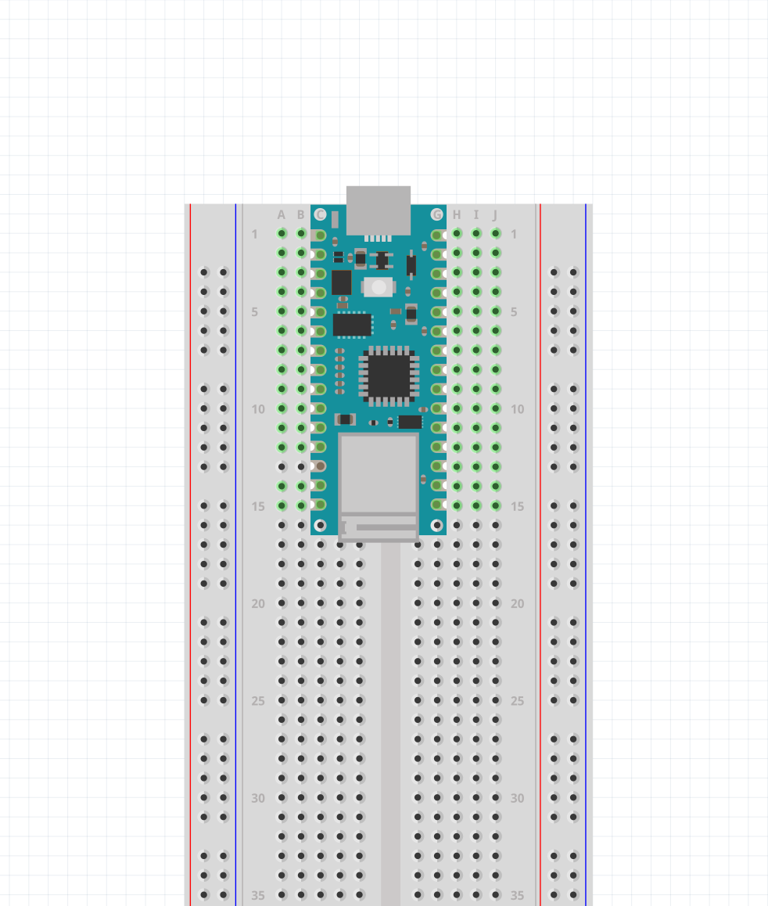

# Getting Set Up

## The Arduino Nano 33 IoT

There are many getting started tutorials with the Arduino online. Usually these guides are using the Arduino Uno. It is good to be aware about this, so that you know the differences and similaritites between them. What you see below is the Uno.

</img>

<i>Arduino Uno</i>

---

</img>

<i>Arduino Nano 33 IoT</i>

And this is the Arduino Nano 33 IoT. The reason I chose to work with this board is because thinking of IoT devices is becoming increasingly important. NYU's ITP physical computing class also uses this <a href="https://itp.nyu.edu/physcomp/introduction-to-the-nano-33-iot/">board</a>, and list their own <a href="https://itp.nyu.edu/physcomp/resources/picking-a-microcontroller/">reasons</a>.

The Nano is also nice because of what its name implies. It's smaller and more compact. Making it easier to embed into an early prototype, making projects less bulky. It also comes with a few built-in features.

### Features

The Arduino Nano is pretty much the same price and comes with these features:

- IoT capabilities (Wi-fi & Bluetooth connectivity)
- Acceleromter/Gyroscope (IMU)
- Real-time clock (RTC)
- Can be used to operate as a mouse, keyboard, or USB MIDI device

<blockquote class="info">
Note

There is also a newer Arduino Uno called the Rev 4 with Wi-fi and RTC capabilities. To see a full list of all the boards available check out their <a href="https://www.arduino.cc/en/hardware">Hardware</a>.

</blockquote>

### Differences

#### 3.3V Logic

<blockquote class="warning">
Warning

The biggest difference between this board and the Arduino Uno is that this is **3.3V logic device**. Meaning the output that is coming from the board pins are 3.3V, not 5V. This also means that it is **NOT 5V tolerant**, which means you could potentially damage the board by introducing it to a circuit meant for 5V.

</blockquote>

#### Micro-USB and Board Care

Another difference that is worth saying is that this board uses a **micro USB cable** rather than USB type B. I have found that proper storage and care of these boards is important. The micro-usb port is prone to ripping off the board and it is not easy to repair, so it is good to be mindful of this.

<blockquote class="warning">
Warning

Don't leave your usb cable on the board when putting it away in a bag. Make sure to remove the cable and to store it safely in a container if you are going to be moving around with it.

</blockquote>

#### More Specs

<ul uk-accordion style='pading-bottom: 5vh'> <li class='uk-close'>
<a id='code-file' class='uk-accordion-title' href='#'>Specs</a>

These details might not be so interesting to a beginner, but this board is:

- Considerably faster. (48MHz clock vs 16MHz clock speed) (32-bit vs 8-bit processor)
- Has more memory. (32KB SRAM/256KB flash vs 2KB/32KB)

The nano uses an <a href="https://www.mouser.com/new/microchip/microchip-technology-sam-d21-mcus/?srsltid=AfmBOooLuzYW-O9P4MNH5tzGV1_M3A7YrtO_CGZK6REXWpHsHzIb4Z--">ARM Cortex-M0 32-bit SAMD21 processor.</a>

Check out ITP's explanation of what microprocessors and microcontrollers are: [https://itp.nyu.edu/physcomp/lessons/microcontrollers-the-basics/](https://itp.nyu.edu/physcomp/lessons/microcontrollers-the-basics/).

### What is Arduino?

</img>

Arduino is an open-source electronics platform with the goal of making it easier to make electronic programmable things. Arduino is just one part of a big family of platforms that make programming more accessible to people who don't necessarily come from an engineering background.

Arduino comes with its own programming language and is considered to be in the world of creative coding/computing, which has a history since the <a href="https://laserpilot.medium.com/a-history-of-creative-coding-8771524b9775">1960s</a>. The definition is quite loose, but it often means that we are focused on writing code for creative expression and for the quick realization of ideas. We are not trying to produce the most clean, elegant, or efficient code. The right attitude is to be curious, let yourself be inspired, and to not get discouraged right away.

This is why Arduino code files are called **sketches**. And the same is true for other creative coding languages like <a href="https://processingfoundation.org/">Processing</a>. Think of making things in this environment similarly to sketching things in a sketchbook.

The Arduino boards are considered to be **microcontrollers**. They are like computers for the physical world.

Before Arduino, microcontrollers existed, but making things like this often required more time and being a bit more savvy with technology.

</img>

<i>Eduardo Kac with his **Ornitorrinco** project (1989 - 1996).</i>

I am in agreement with Jon E. Froehlich highlighting this philosophy:

> **<mark>Learn by Doing</mark>**
> 
> A key pedagogical philosophy underlying our teaching is learn by doing. From years of experience, we’ve found that the best way to teach physical computing is via hands-on exercises. So, we expect that you will build along with our guides and lessons.

How much you get out of this class is completely up to you! Learning Arduino is like learning a new language and it is usually not enough to just watch me code things. The best way to learn is by putting in the time to explore and do things in class and on your own time.

### Pinout

Get familiar with this <a href="https://docs.arduino.cc/resources/pinouts/ABX00027-full-pinout.pdf">document</a> and with the word **pinout**. We will be looking at it a lot to know which pin is which. One inconvenient thing about this board is that the pin labels are on the bottom of the board, and they won't be visible when we place them on breadboards. So we will be looking at this PDF often.

</img>

<i>Screenshot of the PDF provided by the Arduino website.</i>

</img>

<i>Fritzing screenshot.</i>

This image shows how you would place your Arduino on the breadboard and how you would access the pins. By now you should have an idea of how a breadboard works.

It is more convenient to place your nano with the Micro-USB port facing away from the breadboard and on the side starting with row 1. This way you can easily connect to it and so that we can be on the same page when talking about a pin on the board. If I say pin D2, I can also say row 11 on the F-J side (or right side).

<blockquote class="info">
Note

Notice that on the breadboard there are labels on the columns that go from letters A-J, and the rows go from numbers 1 and increment to however many rows there are.

</blockquote>

## Arduino IDE

Now that we have talked about **hardware**, let's talk about **software**.

Go to this <a href="https://www.arduino.cc/en/software">link</a> to download the Arduino IDE (Integrated Development Environment). This is the program that we use that provides us with a code editor and all the other tools needed to work with the Arduino boards.

</img>

Click the appropriate download link for your operating system. If you are using a Mac with M1 or M2 chips, yours is "macOS Apple Silicon".

Once you have it downloaded, try opening it and it should look something like this:

</img>

First things first, we want to confirm that we can successfully upload something to the board. Before we can do that, we need to download something so that the Arduino program knows what board we are working with.

### Install Arduino SAMD Boards

<blockquote class="info">
Note

This info is coming also from the <a href="https://www.arduino.cc/en/Guide/NANO33IoT">Arduino website</a>

</blockquote>

Since our Nano uses the SAMD processor, we need to install the SAMD Core.

On your menu bar go to: **Tools** > **Boards Manager..**

And on the search bar type "SAMD". What pops up should be "Arduino SAMD Boards (32-bits ARM Cortex-M0+)". Click "Install".

Also note that on the left menu bar that the boards manager can be accessed under this icon:

</img>

### Selecting your board and port

<blockquote class="info">
Note

This guide is also provided by the Arduino <a href="https://support.arduino.cc/hc/en-us/articles/4406856349970-Select-board-and-port-in-Arduino-IDE">website.</a>

</blockquote>

#### Selecting the Board

Now all that should be left is to select your board and start uploading to it. First **make sure your board is connected via USB**.

Now that you installed the SAMD core, you should be able to find the Arduino Nano 33 IoT under:

**Tools** > **Board** > **Arduino SAMD Boards** > **Arduino Nano 33 IoT**

#### port

Once selected, you need to select which **port** the Arduino is connected to. Port is referring to serial port, as in USB serial port.

Go to:

**Tools** > **Port** > **'The Port Name that your Nano is connected to'**

The port name could look something like this:

- `COM3 (Arduino Uno)`
- `/dev/cu.usbmodem14101 (Arduino Uno)`
- `/dev/ttyACM0 (Arduino Uno)`

Usually the name of the board shows up in the name, so it should say Arduino NANO 33 IoT instead of Uno in parentheses.

The last step is to make sure that the board name shows up at the top.

</img>

## Upload

The last things we will familiarize ourselves with in this program for now are the "Upload" and "Verify" buttons, and how to get to the example sketches.

### Example Sketches and Uploading

You should know how to navigate to the example sketches. Let's start with the _Blink_ example.

On the top menu bar go to **File** > **Examples** > **01.Basics** > **Blink**

This is the <a href="https://en.wikipedia.org/wiki/%22Hello,_World!%22_program">"Hello World"</a> program for the Arduino. We will use it to confirm that our computers can successfully upload programs to our boards.

Don't worry about what it is doing for now. Locate the upload button on the top, represented by an arrow.

</img>

Try clicking on it and notice what happens on the bottom of the window.

### Output Window

On the bottom there should be text appearing after clicking upload. Either it will feel like a success, or it will print red text to inform you about an ERROR. If there were no errors, then you should be ready to go.

### Verify

Verify is not super important right now, but know that this button is to check that the code in the sketch is free of **syntax errors**. It is represented by a checkmark icon:

</img>

The Upload Button also does this initially before uploading to the board. Clicking "Verify" is faster if you just want to confirm that the code is upload-ready.

## Code not Uploading?

It is good to know of the thngs you can try if your board is not being detected or if your code is not uploading.

Unfortunately it can be finicky to work with these boards and its different depending on your computer. If you are having problems with your board not being detected try this:

- Restarting the Arduino program
- Unplugging and replugging your arduino
- Trying a different USB port
- Pressing the <a href="https://support.arduino.cc/hc/en-us/articles/5779192727068-Reset-your-board">Reset button</a>

It might feel like these methods shouldn't be the solution, but it often is.

When you start getting into building circuits with the board. Another reason your board might not be detected is because there is a **short** somewhere.

## Glossary

- Sketches
- Microcontroller
- Pinout
- IoT
- IDE (Integrated Development Environment)
- Port
- Hardware/Software

