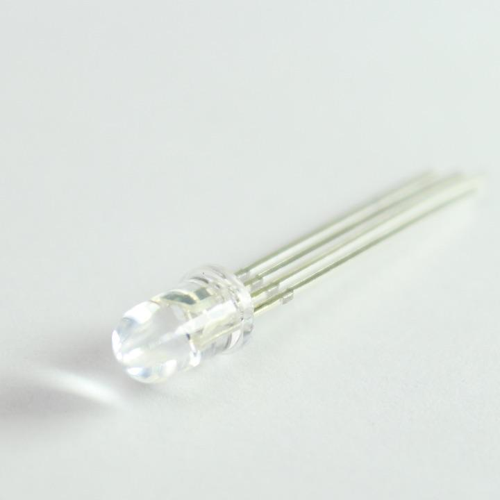
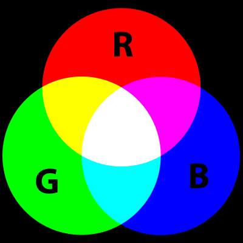
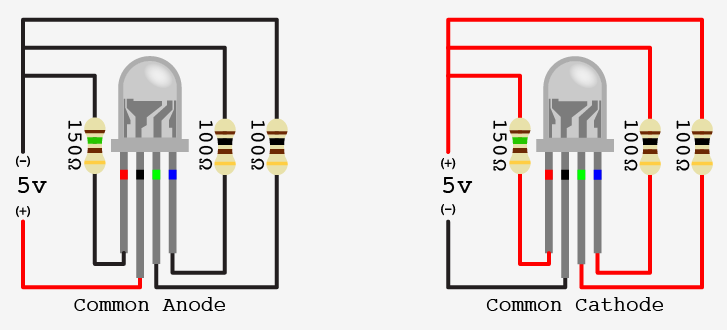

# RGB LED

## Background

</img>

An RGB LED looks like a single LED except it has 4 legs instead of 2. It is actually just 3 LEDs built in one. Obviously RGB is referring to each color LED (RED, GREEN, BLUE).

With light, you can make just about any color with these 3 colors.

</img>

### Common Anode vs. Common Cathode

</img>

When you buy one of these LEDs, it is important to read the [product information](https://www.sparkfun.com/led-rgb-clear-common-anode.html). With RGB LEDs, they can either have a **common cathode**, or a **common anode**. This is important to know how to hook it up to (+) or (-, GND).

The ones that we are using will have a _common anode_.

### The Challenge

Start with the `Fading` example that fades a single LED. You will need to repeat the process two more times with two other independent LEDs.
