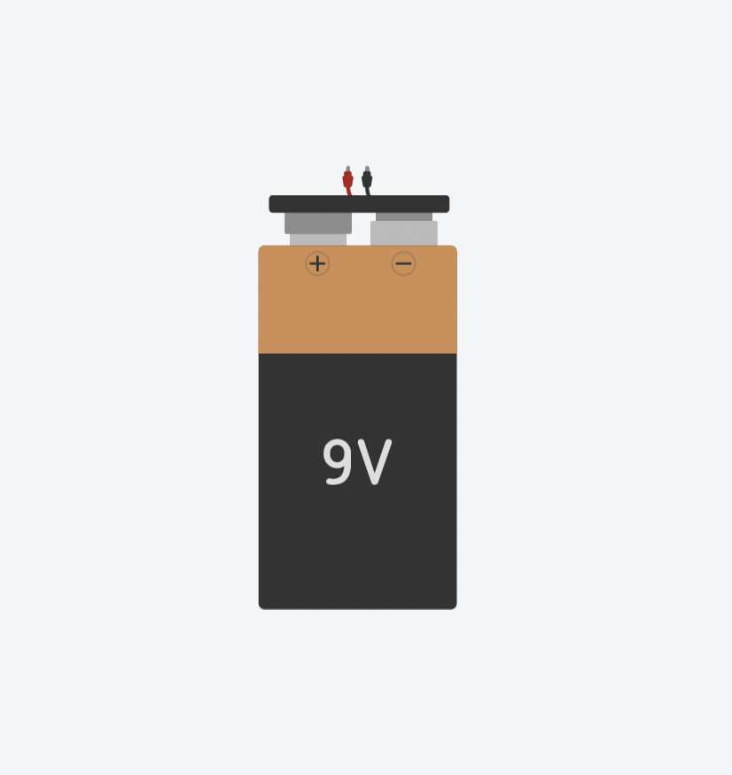
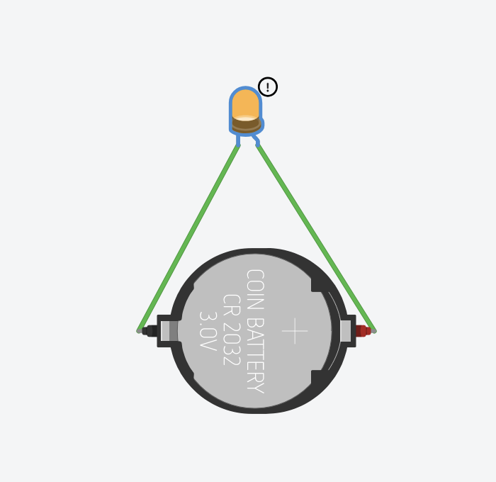
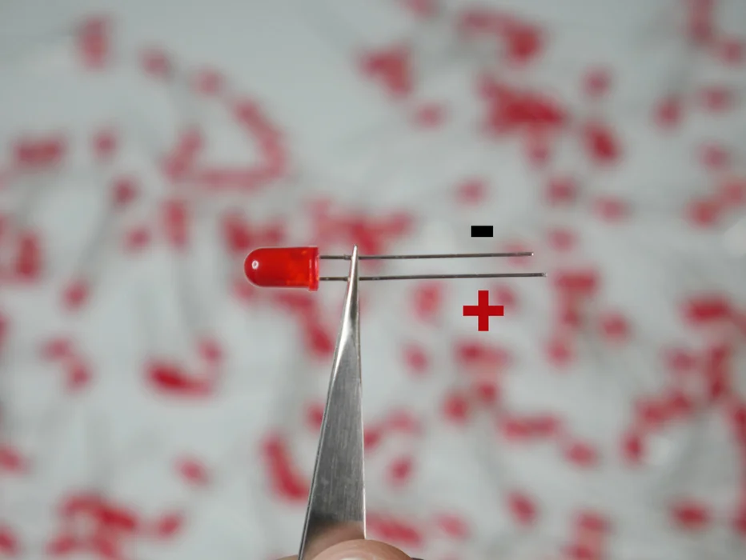
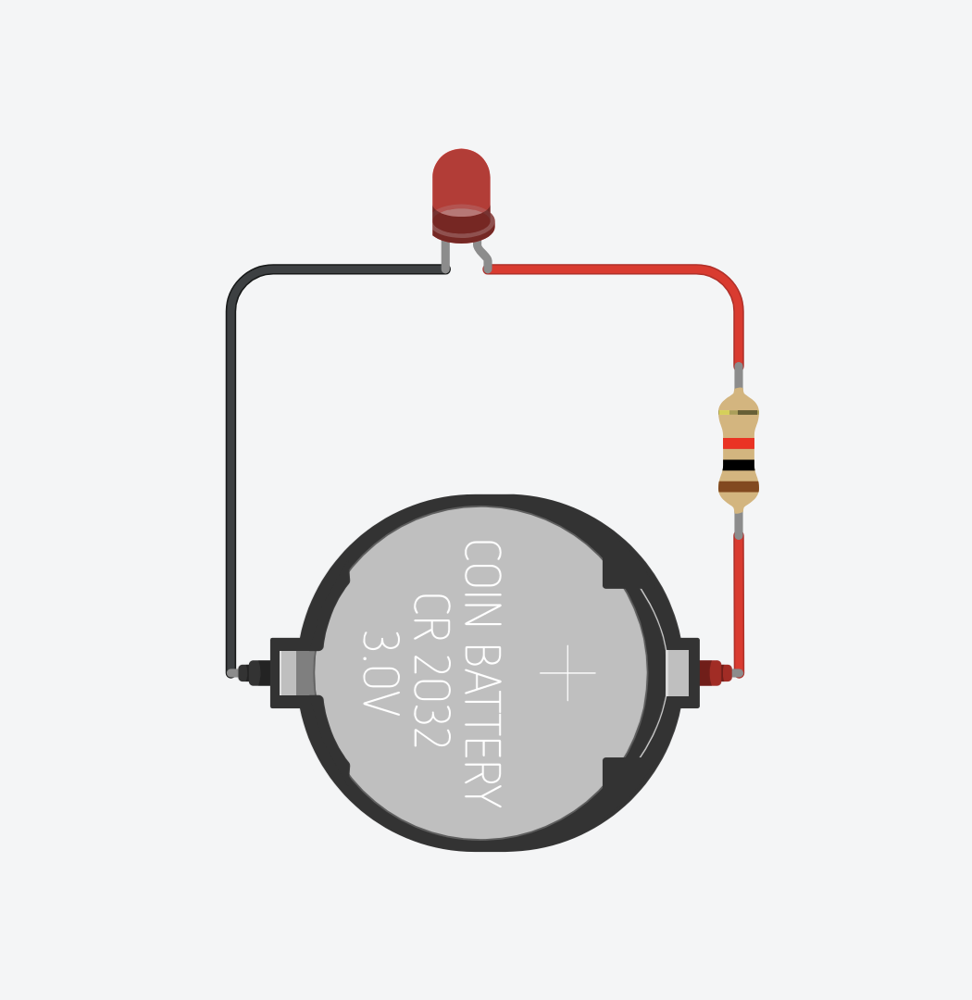

# Intro to TinkerCAD
## What is TinkerCAD?

TinkerCAD is a web based design tool. It can do 3D design, but we are going to be interested in using it to build and simulate circuits as a way to introduce the basics of electronics.

<video width="100%" height="360px" autoplay loop muted>
  <source src="https://ibles-content.tinkercad.com/static/tinkercad/marketing/circuits/hero-circuits-720.mp4" type="video/mp4" />
  Your browser does not support the video tag.
</video>

Below is an embed of the TinkerCAD circuit project that I shared in class. Feel free to interact with it or viewing through the shared classroom designs.

---

<iframe width="100%" height="453" src="https://www.tinkercad.com/embed/e9qoAI7nafb?editbtn=1" frameborder="0" marginwidth="0" marginheight="0" scrolling="no"></iframe>

<blockquote class="info">
Note

TinkerCAD is owned by Autodesk, which also provides software like Fusion, EAGLE, and Maya.

</blockquote>

---

## The Simplest Circuit

The simplest circuit is made of three parts:

- A power supply or (The Source)
- Something that is being powered (The Load)
- A path for electrons to travel (Electrical Conductor)

### The Source

A **power supply** is what is supplying electrical energy. This can be a battery, which converts chemical energy into electrical. 

</img>

### The Load

A **load** is what is consuming that electrical energy. This can transform into another type of energy like light, motion, and heat. 

</img>

### Electrical Conductor

An **electrical conductor** is made of a material that allows the free movement of electrons. When connected to a battery, electrons are pushed through this path. This is usually a metal like copper.

</img>

---

## Building the Simple Circuit in TinkerCAD

Before you can start building circuits, you do have to make an account. Once you do, you can start creating by clicking on the "+ Create" button. Click on the "Circuits" option and you can start building.

</img>

The first thing to notice is that all the basic components are conveniently available to us on the right hand side.

</img>

Clicking on any of them will place it on your cursor until you put it down on the "canvas". Grab an LED and place it down somewhere. Once you do, you might notice that a window pops up. Here you can change some of the properties of this component. For example, with an LED, you can change its color.

Next, try using the search bar and type battery. Doing so will give you three main options.

</img>

Grab the 3V battery and set it near the LED. Try clicking on one of the terminals</strong> are the electrical contacts that are used to connect to a load.">terminals and attach the wire that just appeared to one of the legs of the LED.

If you see it attach successfully do the same with the other side.

If both sides are connected it looks like we have a closed circuit. In theory the LED should light up.

### Start a Simulation

Click "Start Simulation" to start the simulation. You can also press Spacebar. Once it starts, you cannot make any edits. It will "simulate" a circuit meaning that it will work similarly to the real world. The image of the LED should light up.

</img>

If this is your first time building a circuit, then it is 50% likely that your LED does not appear to be on. It should look like the following image.

</img>

If it is not on, it is because the terminals of the battery need to be connected to the 'correct' leg.

### LED Polarity

LED stands for **<mark>Light-Emitting Diode</mark>**. A diode is another basic component. The short explanation is that it is a component that only allows electrical current to pass in **one direction**. It is like a one way street. So just like a battery, it has a **positive** and a **negative** side.

<blockquote class="info">
Note

There is a separate post that goes into more detail about diodes. Feel free to skip it for now. We just want to build a circuit.

<li class="" style="list-style-type: none; margin: auto">

<a href="./Electronics/diode/diode.html">

<h3 class="cardtitle">Diode</h3>

Basic Component

</a>

</li>

</blockquote>

As mentioned, an LED has a positive and a negative leg, meaning that it has **polarity**. Polarity just means that electricity can only flow in one direction.

#### Leg Length

The most common way to determine which leg is which, is by seeing the length of the legs. The longer leg is the positive, which is called the **anode**. The shorter leg is the negative which is called the **cathode**.

</img>

#### Flat Side / Notch

Another way to tell is by seeing which side of the LED has a flat side. This side would be the negative.

</img>

#### Plate

The last way to tell is by looking inside the LED. There are two sectioned plates. The bigger one is the negative side.

</img>

## Protecting the LED

With this information let's go back to TinkerCAD. Hovering over one of the LED legs will reveal what it is.

</img>

I know **anode** means positive, so I will connect it to the positive terminal of the coin cell battery.

I will change the wire colors to match the red and black to match the positive and negative. This does not affect the circuit in any way but it is good practice to keep this convention consistent so that you can visually digest better what is going on.

</img>

</img>

The LED should work now, but there appears the be a warning icon next to the lit LED. Hovering over it reveals a message.

</img>

It says:

> Current through the LED is 61.9mA, while recommended maximum is 20.0 mA. The usable lifetime of the LED may be reduced.

It is telling us that something called current is more than the recommended maximum. There is a lot to unpack here, but i'll cut to the chase. An LED is usually paired with a resistor, another basic component.

</img>

Now the LED is on and the warning is gone, which is what we want, but in order to understand why this thing called a resistor is needed we need to understand a little bit how electricity works.

## Ohm's Law

## Terminology

- Closed and Open Circuit
