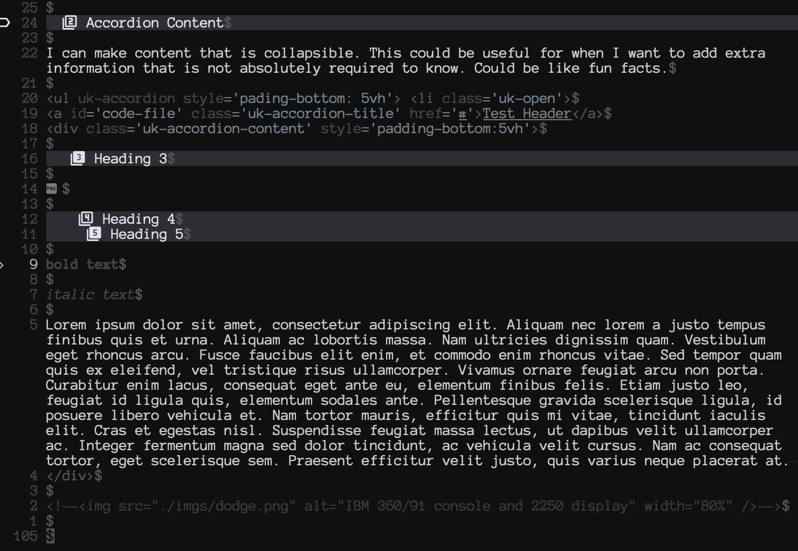

# Blog Workflow with Neovim
## Snippets

With `blink.cmp` and `friendly-snippets`, I am provided with some useful snippets. For example to create a 2x3 table:

```json
"Insert 2x3 table": {
    "prefix": "2x3table",
    "body": [
        "| ${1:Column1} | ${2:Column2} | ${3:Column3} |",
        "| --------------- | --------------- | --------------- |",
        "| ${4:Item1.1} | ${5:Item2.1} | ${6:Item3.1} |",
        "${0}"
    ],
    "description": "Insert table with 2 rows and 3 columns. First row is heading."
},
```

Start typing the prefix `2x3table~` and hit `<C-y>` to autocomplete selection when it comes up. Then just press `<CR>` to confirm. The snippet will be be placed down in the editor and you can start writing inside the cells one by one by pressing Tab to go to the next one.


| Column1 | Column2 | Column3 |
| --------------- | --------------- | --------------- |
| Item1.1 | Item2.1 | Item3.1 |


---

## markview.nvim

This is rendered like this in nvim because of [markview](https://github.com/OXY2DEV/markview.nvim)


---

## Styling

On the table example shown above, I am using [UIkit](https://getuikit.com/docs/introduction) styling.

All tables are added these classes: `uk-table`, `uk-table-striped`, `uk-table-hover`, and `uk-table-middle`.

They are added after page is loaded with this function (using JQuery).

```js
function table_hl() {
    $('table').addClass('uk-table');
    $('table').addClass('uk-table-striped');
    $('table').addClass('uk-table-hover');
    $('table').addClass('uk-table-middle');
}

table_hl();
```

---

## Code Inline and Blocks

I am using [highlight.js](https://highlightjs.org/) to highlight code blocks with a custom css theme. Documentation on how to use is provided [here](https://highlightjs.readthedocs.io/en/latest/readme.html). Additionally, I added badges on the top right of code blocks to make it easy to copy the content with icons for better user experience. The addon is called [highlightjs-badge](https://github.com/RickStrahl/highlightjs-badge).

You can overwrite the default styling by defining new rules in the html file under `<style></style>` tags.

```html
<style>
    .code-badge {
        padding: 8px !important;
        background: pink !important;
    }
    .code-badge-copy-icon {
        font-size: 1.3em !important;
    }
</style>
```

---

## Accordion Content

I can make content that is collapsible. This could be useful for when I want to add extra information that is not absolutely required to know. Could be like fun facts.

<ul uk-accordion style='pading-bottom: 5vh'> <li class='uk-open'>
<a id='code-file' class='uk-accordion-title' href='#'>Test Header</a>
<div class='uk-accordion-content' style='padding-bottom:20px; margin-bottom:20px'>

### Heading 3



#### Heading 4
##### Heading 5

**bold text**

_italic text_

Lorem ipsum dolor sit amet, consectetur adipiscing elit. Aliquam nec lorem a justo tempus finibus quis et urna. Aliquam ac lobortis massa. Nam ultricies dignissim quam. Vestibulum eget rhoncus arcu. Fusce faucibus elit enim, et commodo enim rhoncus vitae. Sed tempor quam quis ex eleifend, vel tristique risus ullamcorper. Vivamus ornare feugiat arcu non porta. Curabitur enim lacus, consequat eget ante eu, elementum finibus felis. Etiam justo leo, feugiat id ligula quis, elementum sodales ante. Pellentesque gravida scelerisque ligula, id posuere libero vehicula et. Nam tortor mauris, efficitur quis mi vitae, tincidunt iaculis elit. Cras et egestas nisl. Suspendisse feugiat massa lectus, ut dapibus velit ullamcorper ac. Integer fermentum magna sed dolor tincidunt, ac vehicula velit cursus. Nam ac consequat tortor, eget scelerisque sem. Praesent efficitur velit justo, quis varius neque placerat at. 
</div>

The html for this accordion div is this:

```html
<ul uk-accordion style='pading-bottom: 5vh'> <li class='uk-open'>
<a id='code-file' class='uk-accordion-title' href='#'>Test Header</a>
<div class='uk-accordion-content' style='padding-bottom:5vh; margin-bottom:5vh'>
</div>
```

I made a VSCode style json snippet for this:

```json
"Accordion": {
    "body": [
        "<ul uk-accordion style='pading-bottom: 5vh'> <li class='uk-open'>",
        "<a id='code-file' class='uk-accordion-title' href='#'>${1:header}</a>",
        "<div class='uk-accordion-content' style='padding-bottom:5vh; margin-bottom:5vh'>",
        "${2:content}",
        "</div>"
    ],
    "description": "Accordion Content",
    "prefix": "acc"
},
```

---

## Admonitions / Callouts

Admonitions can be useful as a brief pause to what is being shown. It highlights things that are important. Key points.

<blockquote class="info">
<span class="uk-label">Note</span>
<p>This is some extra info.</p>
<p>Highlights information that users should take into account, even when skimming.</p>
<div>
</img>
</div>
</blockquote>

<blockquote class="warning">
<span class="uk-label uk-label-warning">Warning</span>
<p>This is a warning. Don't do this!</p>
</blockquote>

<blockquote class="error">
<span class="uk-label uk-label-danger">Danger</span>
<p>This is an error. Please please don't do this. Dangerous!</p>
</blockquote>

<blockquote class="success">
<span class="uk-label uk-label-success">Tip</span>
<p>Some good news, it works! Success.</p>
</blockquote>

I added snippets for all of these.

---

## Youtube Videos

<iframe style="background: black; margin-top:25px; margin-bottom:25px" src="https://www.youtube-nocookie.com/embed/5vRAACeebjI?autoplay=0&amp;showinfo=0&amp;rel=0&amp;modestbranding=1&amp;playsinline=1" width="1920" height="1080" allowfullscreen uk-responsive uk-video="automute: true; autoplay: false"></iframe>

Lorem ipsum dolor sit amet, consectetur adipiscing elit. Aliquam nec lorem a justo tempus finibus quis et urna. Aliquam ac lobortis massa. Nam ultricies dignissim quam. Vestibulum eget rhoncus arcu. Fusce faucibus elit enim, et commodo enim rhoncus vitae. Sed tempor quam quis ex eleifend, vel tristique risus ullamcorper. Vivamus ornare feugiat arcu non porta. Curabitur enim lacus, consequat eget ante eu, elementum finibus felis. Etiam justo leo, feugiat id ligula quis, elementum sodales ante. Pellentesque gravida scelerisque ligula, id posuere libero vehicula et. Nam tortor mauris, efficitur quis mi vitae, tincidunt iaculis elit. Cras et egestas nisl. Suspendisse feugiat massa lectus, ut dapibus velit ullamcorper ac. Integer fermentum magna sed dolor tincidunt, ac vehicula velit cursus. Nam ac consequat tortor, eget scelerisque sem. Praesent efficitur velit justo, quis varius neque placerat at. 

---

## Falstad Circuit Simulation

This is an applet for electronic circuit simulation.  Press "Run / Stop" to start or stop the simulation.

- The green color indicates positive voltage. 
- The gray color indicates ground.
- A red color indicates **negative** voltage.
- The moving yellow dots indicate current.


<iframe style="padding-top:25px;" id="circuitFrame" src="../../CircuitJS/circuitjs.html?ctz=CQAgjCAMB0l3BWcMBMcUHYMGZIA4UA2ATmIxAUgoqoQFMBaMMAKADcQAWbFLnv3pl5UqnWlAkwELMIV7dBGXoTEghakABM6AMwCGAVwA2AFwZG6m8JKixWAJwFOVo-lTDwWAdxAu1S31UFKBYgA" width="800" height="550" uk-responsive></iframe>

The embed this in the website I looked at this [page](https://www.falstad.com/circuit/doc/js-interface.html). I had to download an offline version, put it in my Applications folder, copy the contents of:

```
/Applications/CircuitJS1.app/Contents/Resources/app/war
```

to somewhere in this project directory.

Then I place this in my markdown file:

```html
<iframe style="padding-top:25px;"
id="circuitFrame"
src="../../CircuitJS/circuitjs.html?ctz=CQAgjCAMB0l3BWcMBMcUHYMGZIA4UA2ATmIxAUgoqoQFMBaMMAKADcQAWbFLnv3pl5UqnWlAkwELMIV7dBGXoTEghakABM6AMwCGAVwA2AFwZG6m8JKixWAJwFOVo-lTDwWAdxAu1S31UFKBYgA" width="800" height="550"
uk-responsive></iframe>
```

Notice:

```txt
../../CircuitJS/circuitjs.html?ctz=CQAgjCAMB0l3BWcMBMcUHYMGZIA4UA2ATmIxAUgoqoQFMBaMMAKADcQAWbFLnv3pl5UqnWlAkwELMIV7dBGXoTEghakABM6AMwCGAVwA2AFwZG6m8JKixWAJwFOVo-lTDwWAdxAu1S31UFKBYgA
```

This is the value of `src` for this `iframe`. This is the link to the circuit which links to a `circuitjs.html` file which is the application itself. The specific circuit file is after the `?`. 

In this case I made a simple led resistor circuit in the offline app, exported it as `led_circuit.txt`. In the documentation it says to load the circuit file like this:

```txt
?startCircuit=led_circuit.txt
```

But as of now I could not get it to load.

What worked for me was trying to export it as a link the app:

<div>
</img>
</div>

<span><p style="text-align:center; color: #aeaeae"><i>An example image caption.</i></p></span>

This is where I got the string of symbols above.

---

## \<mark\> to highlight

To highlight text as if it was selected with the cursor, I can surround text with the `<mark></mark>` html tags.

<mark>This is my highlighted text.</mark>

```markdown
<mark>This is my highlighted text.</mark>
```

---

## Tooltips

I want to make it easy to define something without disturbing the flow of the text. Sometimes students already know what something is, but incase someone doesn't they can hover a text to get more info. For example, when referring to a CLI tool, a
<span class="tooltip" style="cursor: pointer;" uk-tooltip="title: A command-line <strong>flag</strong> is a common way to specify options for command-line programs.">flag</span>
might be used (Hover over 'flag').

---

## Styling Sections Divs

I like to alternate the color of sections so that it visually divides them in chunks, rather than feeling like a long strip of content. I use the `--section-divs` flag to add a `<section></section>` tag to each heading.

```bash
pandoc --section-divs                                            \
```

Then I use javascript to get all the sections with ID `level2` and alternate the background:

```js
function sections() {
    var all = $('.level2');
    for (var i = 0; i < all.length; i++) {
        if (i % 2 == 0) {
            $(all[i]).css('background-color', 'white');
        } else {
            $(all[i]).css('background-color', '#dddddd');
        }
    }
}
```

# Another Header 1

## Table of Contents

A table of contents is autogenerated and placed in the offcanvas element.

```html
<!-- TABLE OF CONTENTS -->
<div id="blog-toc" style="top: 50px; background-color: yellow"
uk-offcanvas="mode: slide; container: #contentArea; bg-close: true;">
    <div class="uk-offcanvas-bar">
        <h3 style="color: white">Table of Contents</h3>
        <div>$toc$</div>
    </div>
</div>
```

I use [pandoc](https://pandoc.org/) to convert my markdown file to html upon saving. You can see that pandoc takes my headers and places them in place of the `$toc$` variable.
