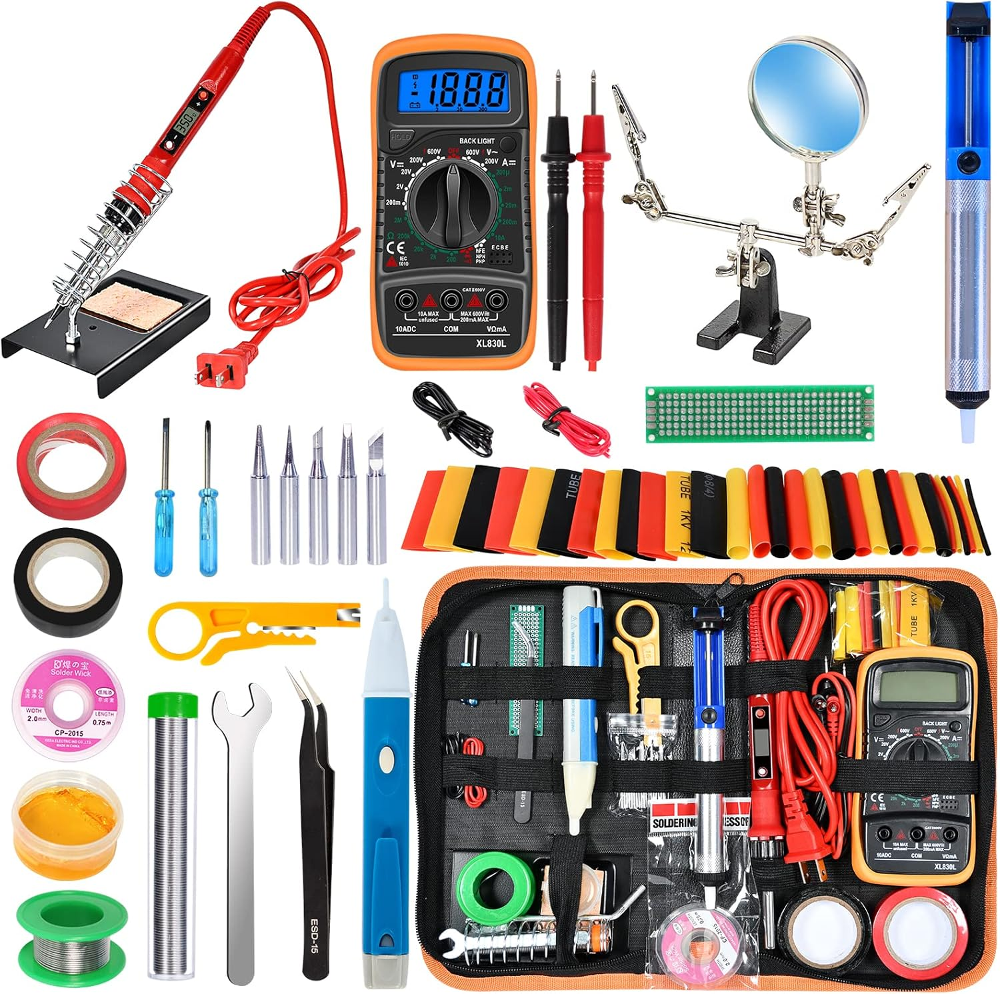
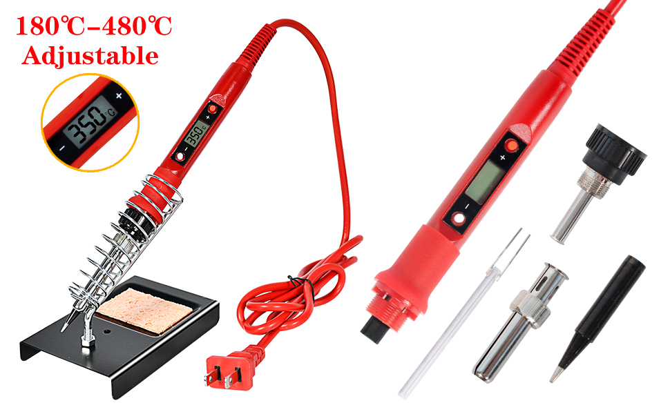
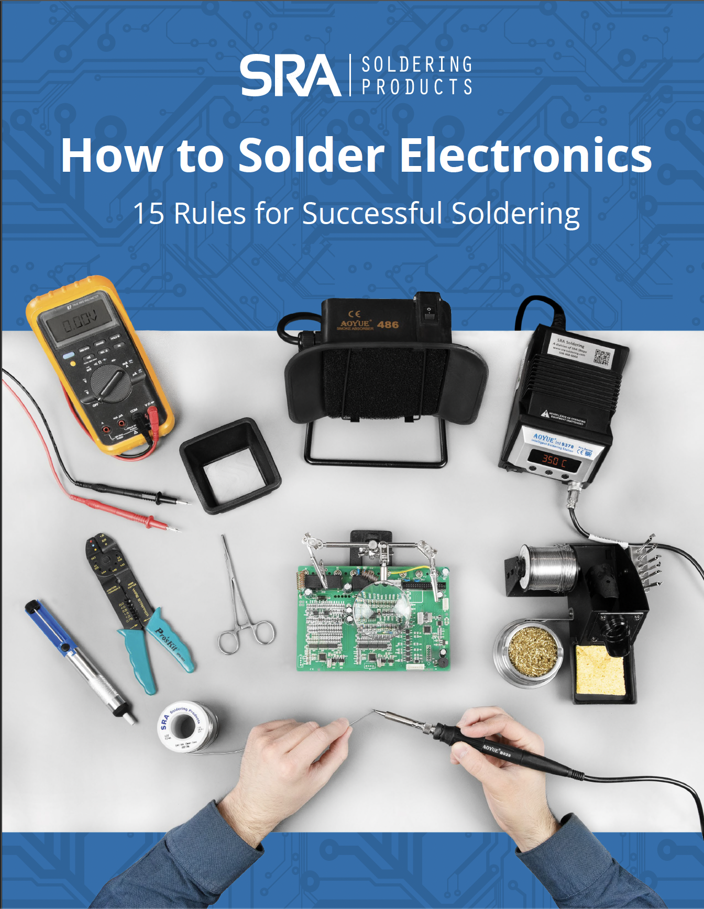
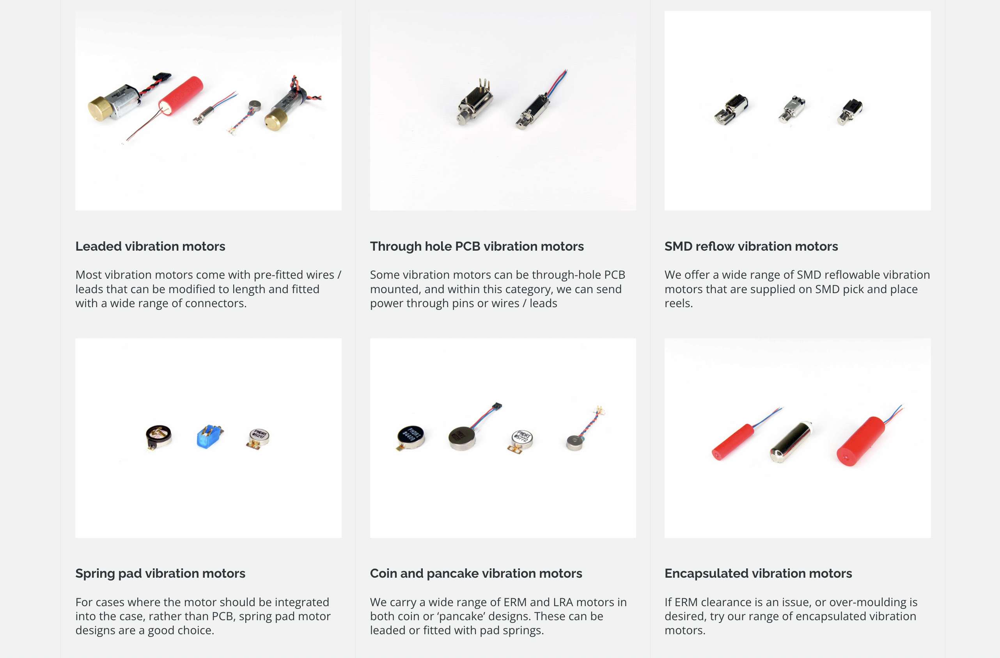
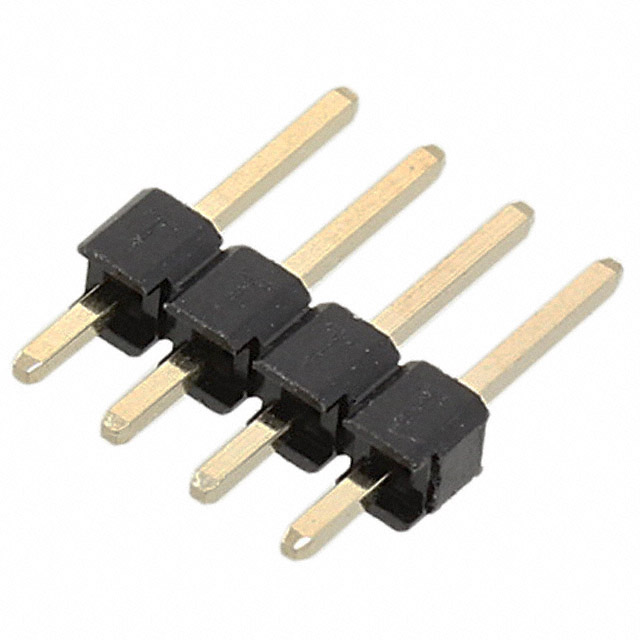
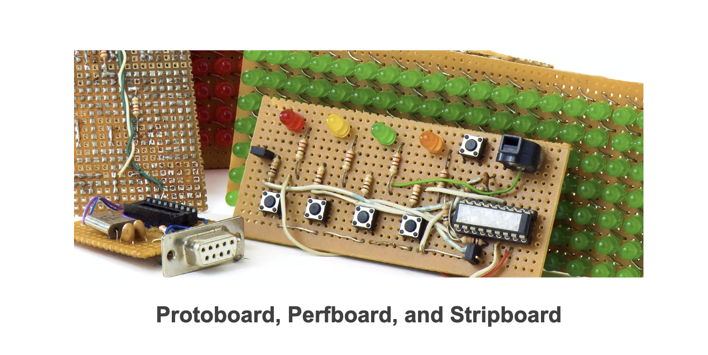

## Week 3 - Soldering Workshop with Vibration Motors
<!-- .slide: class=".uk-width-1-1 uk-height-large" -->  

Note:

---

## Solder Kit Breakdown

<a target="_blank" href="https://www.precisionmicrodrives.com/motors/vibration-motors">
</img>
</a>

---

## Soldering Irons
<!-- .slide: class="uk-column-1-2 uk-column-divider uk-vertical-align-middle" -->  

1. Simple Unregulated Soldering Irons

<mark>
<strong style="font-size: 20px;">
2. Simple Regulated Soldering Irons
</strong>
</mark>

3. Regulated Soldering Station

4. USB Powered Soldering Iron

<a target="_blank" href="https://www.precisionmicrodrives.com/motors/vibration-motors">
</img>
</a>

---

## Iron Types Continued
<!-- .slide: class="uk-column-1-1 uk-column-divider uk-vertical-align-middle" -->  

<a target="_blank" href="#">
</img>
</a>
$27.21

<a target="_blank" href="#">
</img>
</a>
$53.91

<a target="_blank" href="#">
</img>
</a>
$44.99

---

## Soldering Iron Stand with Sponge

Holder: To hold your hot iron safely
Sponge: For cleaning excess solder
<a target="_blank" href="#">
</img>
</a>

---

## Solder Wire

Usually mainly made of Tin (Sn). It is a metal alloy (mixture of metals) that make it possible to liquify and harden quickly. This is how we join together two or more pieces of metal.
<a target="_blank" href="#">
</img>
</a>

---

## Flux

A chemical agent that de-oxidizes the metals you're soldering. Flux is commonly found inside solder wire.
<a target="_blank" href="#">
</img>
</a>

---

## Helping Hands

Also may be called (Third Hand) or Vise. They make it easier to hold components together while soldering.
<a target="_blank" href="#">
</img>
</a>

---

## Desoldering

<a target="_blank" href="#">
</img>
</a>

Desoldering Pump

<a target="_blank" href="#">
</img>
</a>
Solder Wick

---

## How to Solder Guides

Guides are uploaded on Canvas.

<a target="_blank" href="https://www.precisionmicrodrives.com/motors/vibration-motors">
</img>
</a>

---

## Vibration Motors

<a target="_blank" href="https://www.precisionmicrodrives.com/motors/vibration-motors">
</img>
</a>

---

## Headers, Male Pins

<a target="_blank" href="https://www.digikey.com/en/products/detail/w-rth-elektronik/61300411121/4846827?gclsrc=aw.ds&&utm_adgroup=&utm_source=google&utm_medium=cpc&utm_campaign=PMax%20Supplier_Focus%20Supplier&utm_term=&utm_content=&utm_id=go_cmp-20243063242_adg-_ad-__dev-c_ext-_prd-4846827_sig-CjwKCAiA5Ka9BhB5EiwA1ZVtvArwHYB7x2fT1f-_uX-iBCfI7DdkNiRc2rlrc8E-gk7BCwTQ0JFRQhoCfmEQAvD_BwE&gad_source=1&gclid=CjwKCAiA5Ka9BhB5EiwA1ZVtvArwHYB7x2fT1f-_uX-iBCfI7DdkNiRc2rlrc8E-gk7BCwTQ0JFRQhoCfmEQAvD_BwE&gclsrc=aw.ds">
</img>
</a>

</img>

---

## Protoboards, Perfboard, and Stripboard

<a target="_blank" href="#">
</img>
</a>

---

## Perfboard

<a target="_blank" href="https://www.amazon.com/YUNGUI-Prototype-Universal-Breadboard-Electronic/dp/B07YFYNB7G/ref=sxin_16_pa_sp_search_thematic_sspa?content-id=amzn1.sym.c5787da2-212d-48eb-a894-9ea5a87adeb3%3Aamzn1.sym.c5787da2-212d-48eb-a894-9ea5a87adeb3&crid=J6W5IKFYV56L&cv_ct_cx=protoboard+long&keywords=protoboard+long&pd_rd_i=B07YFYNB7G&pd_rd_r=f3bb2400-10c3-43b9-af0b-622a2a2c4c2e&pd_rd_w=xZsPl&pd_rd_wg=9jls3&pf_rd_p=c5787da2-212d-48eb-a894-9ea5a87adeb3&pf_rd_r=11JC4S7W6ABQTVAGF9AB&qid=1739222527&sbo=RZvfv%2F%2FHxDF%2BO5021pAnSA%3D%3D&sprefix=protoboard+lon%2Caps%2C139&sr=1-3-6024b2a3-78e4-4fed-8fed-e1613be3bcce-spons&sp_csd=d2lkZ2V0TmFtZT1zcF9zZWFyY2hfdGhlbWF0aWM&psc=1">
</img>
</a>

---

## Using Perfboards

<a target="_blank" href="https://www.instructables.com/Using-Perfboard/">
</img>
</a>

