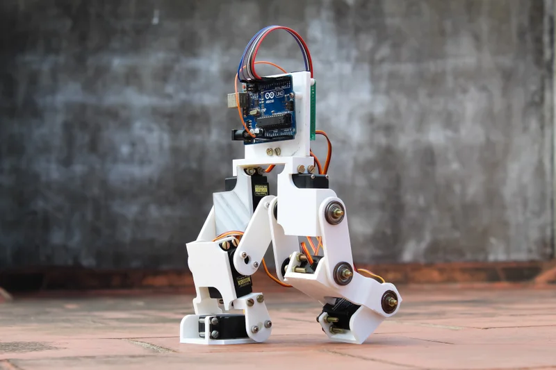
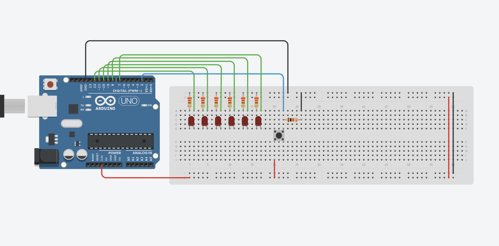
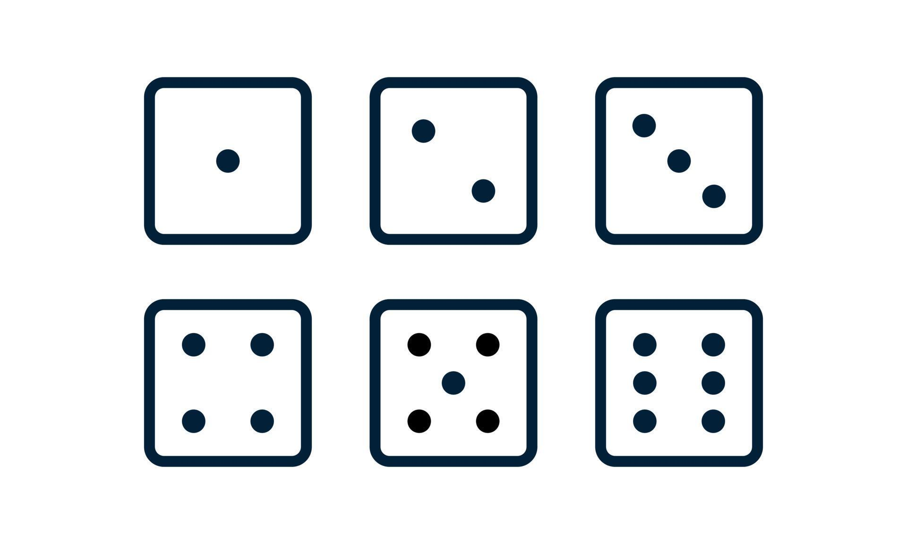
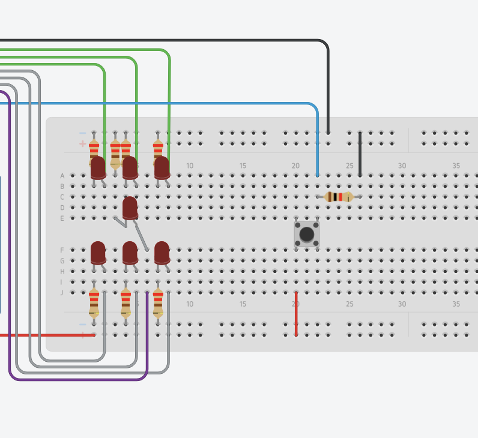
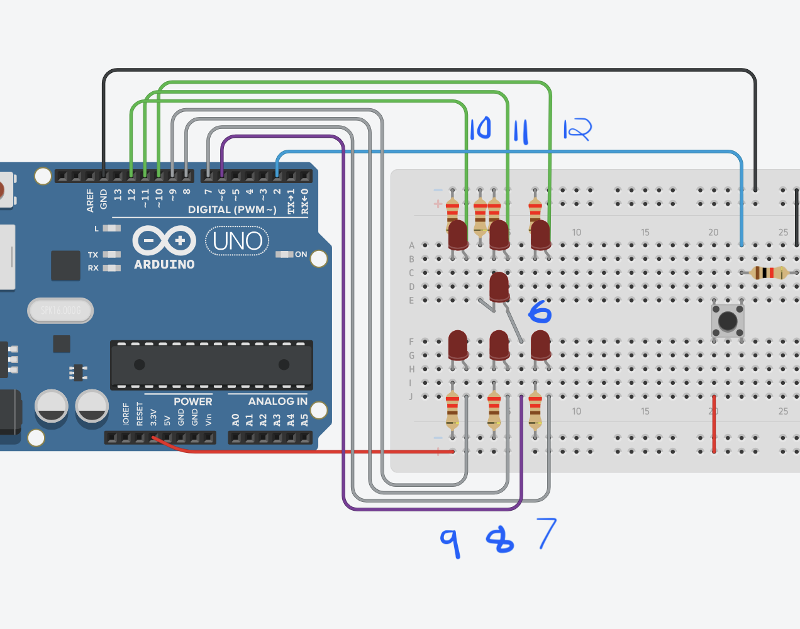

### Week 5 - Learning How to Walk: Pulse Width Modulation, Functions, Analog Input
<!-- .slide: class="" style=" height: 80vh" -->  

<div>
</img>
</div>

---

### Dice Roller (Continued)
<!-- .slide: class="" style=" height: 80vh" -->  

<div>
<a href="https://www.tinkercad.com/things/ie93D0rU3rM-dice-roller-starter/editel?returnTo=https%3A%2F%2Fwww.tinkercad.com%2Fdashboard">
</img>
</a>
</div>

---

### Dice Roller (Continued)
<!-- .slide: class="code_slide" style=" height: 100vh" -->  

<pre>
<code class="c-language data-line-numbers" data-trim data-noescape data-line-numbers="0|1|1-8">
// Declare constants
const int led_pin1 = 12;
const int led_pin2 = 11;
const int led_pin3 = 10;
const int led_pin4 = 9;
const int led_pin5 = 8;
const int led_pin6 = 7;

void setup() {

}

void loop() {

}
</code>
</pre>

---

### Dice Roller (Continued)
<!-- .slide: class="code_slide" style=" height: 100vh" -->  

```js [1: 10|10|11-16|9-17]
// declare constants
const int led_pin1 = 12;
const int led_pin2 = 11;
const int led_pin3 = 10;
const int led_pin4 = 9;
const int led_pin5 = 8;
const int led_pin6 = 7;

void setup() {
    // set led pins as outputs
    pinMode(led_pin1, OUTPUT);
    pinMode(led_pin2, OUTPUT);
    pinMode(led_pin3, OUTPUT);
    pinMode(led_pin4, OUTPUT);
    pinMode(led_pin5, OUTPUT);
    pinMode(led_pin6, OUTPUT);
}

void loop() {

}
```

---

### Dice Roller (Continued)
<!-- .slide: class="code_slide" style=" height: 100vh" -->  

```js [1: 9|9|9-10]
// declare constants
const int led_pin1 = 12;
const int led_pin2 = 11;
const int led_pin3 = 10;
const int led_pin4 = 9;
const int led_pin5 = 8;
const int led_pin6 = 7;

// declare variables
int dice_roll = 0;

void setup() {
    // set led pins as outputs
    pinMode(led_pin1, OUTPUT);
    pinMode(led_pin2, OUTPUT);
    pinMode(led_pin3, OUTPUT);
    pinMode(led_pin4, OUTPUT);
    pinMode(led_pin5, OUTPUT);
    pinMode(led_pin6, OUTPUT);
}

void loop() {

}
```


---

### Dice Roller (Continued)
<!-- .slide: class="code_slide" style=" height: 100vh" -->  

```js [1: 23|23|23-24]
// declare constants
const int led_pin1 = 12;
const int led_pin2 = 11;
const int led_pin3 = 10;
const int led_pin4 = 9;
const int led_pin5 = 8;
const int led_pin6 = 7;

// declare variables
int dice_roll = 0;

void setup() {
    // set led pins as outputs
    pinMode(led_pin1, OUTPUT);
    pinMode(led_pin2, OUTPUT);
    pinMode(led_pin3, OUTPUT);
    pinMode(led_pin4, OUTPUT);
    pinMode(led_pin5, OUTPUT);
    pinMode(led_pin6, OUTPUT);
}

void loop() {
    // get a random number each loop
    dice_roll = random(6);
}
```

---

### Dice Roller (Continued)
<!-- .slide: class="code_slide" style=" height: 100vh" -->  

```js [1: 21|21|21-22]
// declare constants
const int led_pin1 = 12;
const int led_pin2 = 11;
const int led_pin3 = 10;
const int led_pin4 = 9;
const int led_pin5 = 8;
const int led_pin6 = 7;

// declare variables
int dice_roll = 0;

void setup() {
    // set led pins as outputs
    pinMode(led_pin1, OUTPUT);
    pinMode(led_pin2, OUTPUT);
    pinMode(led_pin3, OUTPUT);
    pinMode(led_pin4, OUTPUT);
    pinMode(led_pin5, OUTPUT);
    pinMode(led_pin6, OUTPUT);

    // initialize serial monitor use
    Serial.begin(9600);
}

void loop() {
    // get a random number each loop
    dice_roll = random(6);
}
```


---

### Dice Roller (Continued)
<!-- .slide: class="code_slide" style=" height: 100vh" -->  

```js [1: 29|29|29-30]
// declare constants
const int led_pin1 = 12;
const int led_pin2 = 11;
const int led_pin3 = 10;
const int led_pin4 = 9;
const int led_pin5 = 8;
const int led_pin6 = 7;

// declare variables
int dice_roll = 0;

void setup() {
    // set led pins as outputs
    pinMode(led_pin1, OUTPUT);
    pinMode(led_pin2, OUTPUT);
    pinMode(led_pin3, OUTPUT);
    pinMode(led_pin4, OUTPUT);
    pinMode(led_pin5, OUTPUT);
    pinMode(led_pin6, OUTPUT);

    // initialize serial monitor use
    Serial.begin(9600);
}

void loop() {
    // get a random number each loop
    dice_roll = random(6);

    // print dice_roll to Serial Monitor
    Serial.println(dice_roll);
}
```

---

### Dice Roller (Continued)
<!-- .slide: class="code_slide" style=" height: 100vh" -->  

```js [1: 32|32|32-35|36-38|39-41|32-50]
// declare constants
const int led_pin1 = 12;
const int led_pin2 = 11;
const int led_pin3 = 10;
const int led_pin4 = 9;
const int led_pin5 = 8;
const int led_pin6 = 7;

// declare variables
int dice_roll = 0;

void setup() {
    // set led pins as outputs
    pinMode(led_pin1, OUTPUT);
    pinMode(led_pin2, OUTPUT);
    pinMode(led_pin3, OUTPUT);
    pinMode(led_pin4, OUTPUT);
    pinMode(led_pin5, OUTPUT);
    pinMode(led_pin6, OUTPUT);

    // initialize serial monitor use
    Serial.begin(9600);
}

void loop() {
    // get a random number each loop
    dice_roll = random(6);

    // print dice_roll to Serial Monitor
    Serial.println(dice_roll);

    // light up a random LED
    if (dice_roll == 0) {
        digitalWrite(led_pin1, HIGH);
    } 
    else if (dice_roll == 1) {
        digitalWrite(led_pin2, HIGH);
    } 
    else if (dice_roll == 2) {
        digitalWrite(led_pin3, HIGH);
    } 
    else if (dice_roll == 3) {
        digitalWrite(led_pin4, HIGH);
    } 
    else if (dice_roll == 4) {
        digitalWrite(led_pin5, HIGH);
    } 
    else if (dice_roll == 5) {
        digitalWrite(led_pin6, HIGH);
    }

    // add a delay of 1 second
    delay(1000);
}
```

---

### Dice Roller (Continued)
<!-- .slide: class="code_slide" style=" height: 100vh" -->  

```js [1: 55|55|55-61]
// declare constants
const int led_pin1 = 12;
const int led_pin2 = 11;
const int led_pin3 = 10;
const int led_pin4 = 9;
const int led_pin5 = 8;
const int led_pin6 = 7;

// declare variables
int dice_roll = 0;

void setup() {
    // set led pins as outputs
    pinMode(led_pin1, OUTPUT);
    pinMode(led_pin2, OUTPUT);
    pinMode(led_pin3, OUTPUT);
    pinMode(led_pin4, OUTPUT);
    pinMode(led_pin5, OUTPUT);
    pinMode(led_pin6, OUTPUT);

    // initialize serial monitor use
    Serial.begin(9600);
}

void loop() {
    // get a random number each loop
    dice_roll = random(6);

    // print dice_roll to Serial Monitor
    Serial.println(dice_roll);

    // light up a random LED
    if (dice_roll == 0) {
        digitalWrite(led_pin1, HIGH);
    } 
    else if (dice_roll == 1) {
        digitalWrite(led_pin2, HIGH);
    } 
    else if (dice_roll == 2) {
        digitalWrite(led_pin3, HIGH);
    } 
    else if (dice_roll == 3) {
        digitalWrite(led_pin4, HIGH);
    } 
    else if (dice_roll == 4) {
        digitalWrite(led_pin5, HIGH);
    } 
    else if (dice_roll == 5) {
        digitalWrite(led_pin6, HIGH);
    }

    // add a delay of 1 second
    delay(1000);

    // reset LEDs
    digitalWrite(led_pin1, LOW);
    digitalWrite(led_pin2, LOW);
    digitalWrite(led_pin3, LOW);
    digitalWrite(led_pin4, LOW);
    digitalWrite(led_pin5, LOW);
    digitalWrite(led_pin6, LOW);
}
```


---

### Dice Roller (Continued)
<!-- .slide: class="code_slide" style=" height: 100vh" -->  

```js [1: 9|9]
// declare constants
const int led_pin1 = 12;
const int led_pin2 = 11;
const int led_pin3 = 10;
const int led_pin4 = 9;
const int led_pin5 = 8;
const int led_pin6 = 7;

const int button_pin = 2;

// declare variables
int dice_roll = 0;

void setup() {
    // set led pins as outputs
    pinMode(led_pin1, OUTPUT);
    pinMode(led_pin2, OUTPUT);
    pinMode(led_pin3, OUTPUT);
    pinMode(led_pin4, OUTPUT);
    pinMode(led_pin5, OUTPUT);
    pinMode(led_pin6, OUTPUT);

    // initialize serial monitor use
    Serial.begin(9600);
}

void loop() {
    // get a random number each loop
    dice_roll = random(6);

    // print dice_roll to Serial Monitor
    Serial.println(dice_roll);

    // light up a random LED
    if (dice_roll == 0) {
        digitalWrite(led_pin1, HIGH);
    } 
    else if (dice_roll == 1) {
        digitalWrite(led_pin2, HIGH);
    } 
    else if (dice_roll == 2) {
        digitalWrite(led_pin3, HIGH);
    } 
    else if (dice_roll == 3) {
        digitalWrite(led_pin4, HIGH);
    } 
    else if (dice_roll == 4) {
        digitalWrite(led_pin5, HIGH);
    } 
    else if (dice_roll == 5) {
        digitalWrite(led_pin6, HIGH);
    }

    // add a delay of 1 second
    delay(1000);

    // reset LEDs
    digitalWrite(led_pin1, LOW);
    digitalWrite(led_pin2, LOW);
    digitalWrite(led_pin3, LOW);
    digitalWrite(led_pin4, LOW);
    digitalWrite(led_pin5, LOW);
    digitalWrite(led_pin6, LOW);
}
```


---

### Dice Roller (Continued)
<!-- .slide: class="code_slide" style=" height: 100vh" -->  

```js [1: 23|23|23-24]
// declare constants
const int led_pin1 = 12;
const int led_pin2 = 11;
const int led_pin3 = 10;
const int led_pin4 = 9;
const int led_pin5 = 8;
const int led_pin6 = 7;

const int button_pin = 2;

// declare variables
int dice_roll = 0;

void setup() {
    // set led pins as outputs
    pinMode(led_pin1, OUTPUT);
    pinMode(led_pin2, OUTPUT);
    pinMode(led_pin3, OUTPUT);
    pinMode(led_pin4, OUTPUT);
    pinMode(led_pin5, OUTPUT);
    pinMode(led_pin6, OUTPUT);

    // set button pin as input
    pinMode(button_pin, INPUT);

    // initialize serial monitor use
    Serial.begin(9600);
}

void loop() {
    // get a random number each loop
    dice_roll = random(6);

    // print dice_roll to Serial Monitor
    Serial.println(dice_roll);

    // light up a random LED
    if (dice_roll == 0) {
        digitalWrite(led_pin1, HIGH);
    } 
    else if (dice_roll == 1) {
        digitalWrite(led_pin2, HIGH);
    } 
    else if (dice_roll == 2) {
        digitalWrite(led_pin3, HIGH);
    } 
    else if (dice_roll == 3) {
        digitalWrite(led_pin4, HIGH);
    } 
    else if (dice_roll == 4) {
        digitalWrite(led_pin5, HIGH);
    } 
    else if (dice_roll == 5) {
        digitalWrite(led_pin6, HIGH);
    }

    // add a delay of 1 second
    delay(1000);

    // reset LEDs
    digitalWrite(led_pin1, LOW);
    digitalWrite(led_pin2, LOW);
    digitalWrite(led_pin3, LOW);
    digitalWrite(led_pin4, LOW);
    digitalWrite(led_pin5, LOW);
    digitalWrite(led_pin6, LOW);
}
```

---

### Dice Roller (Continued)
<!-- .slide: class="code_slide" style=" height: 100vh" -->  

```js [1: 37-55]
// declare constants
const int led_pin1 = 12;
const int led_pin2 = 11;
const int led_pin3 = 10;
const int led_pin4 = 9;
const int led_pin5 = 8;
const int led_pin6 = 7;

const int button_pin = 2;

// declare variables
int dice_roll = 0;

void setup() {
    // set led pins as outputs
    pinMode(led_pin1, OUTPUT);
    pinMode(led_pin2, OUTPUT);
    pinMode(led_pin3, OUTPUT);
    pinMode(led_pin4, OUTPUT);
    pinMode(led_pin5, OUTPUT);
    pinMode(led_pin6, OUTPUT);

    // set button pin as input
    pinMode(button_pin, INPUT);

    // initialize serial monitor use
    Serial.begin(9600);
}

void loop() {
    // get a random number each loop
    dice_roll = random(6);

    // print dice_roll to Serial Monitor
    Serial.println(dice_roll);

    // light up a random LED
    if (dice_roll == 0) {
        digitalWrite(led_pin1, HIGH);
    } 
    else if (dice_roll == 1) {
        digitalWrite(led_pin2, HIGH);
    } 
    else if (dice_roll == 2) {
        digitalWrite(led_pin3, HIGH);
    } 
    else if (dice_roll == 3) {
        digitalWrite(led_pin4, HIGH);
    } 
    else if (dice_roll == 4) {
        digitalWrite(led_pin5, HIGH);
    } 
    else if (dice_roll == 5) {
        digitalWrite(led_pin6, HIGH);
    }

    // add a delay of 1 second
    delay(1000);

    // reset LEDs
    digitalWrite(led_pin1, LOW);
    digitalWrite(led_pin2, LOW);
    digitalWrite(led_pin3, LOW);
    digitalWrite(led_pin4, LOW);
    digitalWrite(led_pin5, LOW);
    digitalWrite(led_pin6, LOW);
}
```

---

### Dice Roller (Continued)
<!-- .slide: class="code_slide" style=" height: 100vh" -->  

```js [1: 38|38|38-41|13]
// declare constants
const int led_pin1 = 12;
const int led_pin2 = 11;
const int led_pin3 = 10;
const int led_pin4 = 9;
const int led_pin5 = 8;
const int led_pin6 = 7;

const int button_pin = 2;

// declare variables
int dice_roll = 0;
int picked_led = 0;

void setup() {
    // set led pins as outputs
    pinMode(led_pin1, OUTPUT);
    pinMode(led_pin2, OUTPUT);
    pinMode(led_pin3, OUTPUT);
    pinMode(led_pin4, OUTPUT);
    pinMode(led_pin5, OUTPUT);
    pinMode(led_pin6, OUTPUT);

    // set button pin as input
    pinMode(button_pin, INPUT);

    // initialize serial monitor use
    Serial.begin(9600);
}

void loop() {
    // get a random number each loop
    dice_roll = random(6);

    // print dice_roll to Serial Monitor
    Serial.println(dice_roll);

    // if button is pressed
    if (buttonState == HIGH) {
        picked_led = random(7, 13);
    }

    // add a delay of 1 second
    delay(1000);

    // reset LEDs
    digitalWrite(led_pin1, LOW);
    digitalWrite(led_pin2, LOW);
    digitalWrite(led_pin3, LOW);
    digitalWrite(led_pin4, LOW);
    digitalWrite(led_pin5, LOW);
    digitalWrite(led_pin6, LOW);
}
```


---

### Dice Roller (Continued)
<!-- .slide: class="code_slide" style=" height: 100vh" -->  

```js [1: 37-39|41|41-43|45-51|54|54-57]
// declare constants
const int led_pin1 = 12;
const int led_pin2 = 11;
const int led_pin3 = 10;
const int led_pin4 = 9;
const int led_pin5 = 8;
const int led_pin6 = 7;

const int button_pin = 2;

// declare variables
int dice_roll = 0;

void setup() {
    // set led pins as outputs
    pinMode(led_pin1, OUTPUT);
    pinMode(led_pin2, OUTPUT);
    pinMode(led_pin3, OUTPUT);
    pinMode(led_pin4, OUTPUT);
    pinMode(led_pin5, OUTPUT);
    pinMode(led_pin6, OUTPUT);

    // set button pin as input
    pinMode(button_pin, INPUT);

    // initialize serial monitor use
    Serial.begin(9600);
}

void loop() {
    // get a random number each loop
    dice_roll = random(6);

    // print dice_roll to Serial Monitor
    Serial.println(dice_roll);

    // if button is pressed
    if (buttonState == HIGH) {
        picked_led = random(7, 13);

        // show random selections while pressed
        digitalWrite(picked_led, HIGH);
        delay(40);

        // reset LEDs
        digitalWrite(led_pin2, LOW);
        digitalWrite(led_pin3, LOW);
        digitalWrite(led_pin4, LOW);
        digitalWrite(led_pin5, LOW);
        digitalWrite(led_pin6, LOW);
        digitalWrite(led_pin1, LOW);
    }

    // if button is unpressed
    else {
        digitalWrite(picked_led, HIGH);
    }

    // add a delay of 1 second
    delay(1000);

    // reset LEDs
    digitalWrite(led_pin1, LOW);
    digitalWrite(led_pin2, LOW);
    digitalWrite(led_pin3, LOW);
    digitalWrite(led_pin4, LOW);
    digitalWrite(led_pin5, LOW);
    digitalWrite(led_pin6, LOW);
}
```

---

### Test

<div>
<a href="https://www.tinkercad.com/things/ie93D0rU3rM-dice-roller-starter/editel?returnTo=https%3A%2F%2Fwww.tinkercad.com%2Fdashboard">
</img>
</a>
</div>

---

### Dot Format

<div>
</img>
</div>

---

### Dot Format

<div>
</img>
</div>

---

### Keeping track of pins

<div>
</img>
</div>

---

### if (dice_roll == 1)

```js
// lands on 1
if (dice_roll == 0) {
    digitalWrite(6, HIGH);
} 
```

---

### if (dice_roll == 2)

```js
// lands on 2
  else if (dice_roll == 1) {
    digitalWrite(12, HIGH);
    digitalWrite(7, HIGH);
  }
```

---

### if (dice_roll == 5)

```js
// lands on 5
  else if (dice_roll == 4) {
    digitalWrite(12, HIGH);
    digitalWrite(10, HIGH);
    digitalWrite(9, HIGH);
    digitalWrite(7, HIGH);
    digitalWrite(6, HIGH);
  }
```


---
<!-- .slide: class="" style=" height: 80vh" -->  

```js
  if (dice_roll == 0) {
    digitalWrite(6, HIGH);
  } 
  else if (dice_roll == 1) {
    digitalWrite(12, HIGH);
    digitalWrite(7, HIGH);
  }
  else if (dice_roll == 2) {
    digitalWrite(12, HIGH);
    digitalWrite(7, HIGH);
    digitalWrite(6, HIGH);
  } 
  else if (dice_roll == 3) {
    digitalWrite(12, HIGH);
    digitalWrite(10, HIGH);
    digitalWrite(9, HIGH);
    digitalWrite(7, HIGH);
  } 
  else if (dice_roll == 4) {
    digitalWrite(12, HIGH);
    digitalWrite(10, HIGH);
    digitalWrite(9, HIGH);
    digitalWrite(7, HIGH);
    digitalWrite(6, HIGH);
  } 
  else if (dice_roll == 5) {
    digitalWrite(12, HIGH);
    digitalWrite(11, HIGH);
    digitalWrite(10, HIGH);
    digitalWrite(9, HIGH);
    digitalWrite(8, HIGH);
    digitalWrite(7, HIGH);
  }
```

---

### Functions
<!-- .slide: class="" style=" height: 80vh" -->  

<iframe width="100%" height="100%" src="https://www.youtube.com/embed/BWZTlfrneD8?si=wmDdk5cXeUT5JheC&amp;controls=0" title="YouTube video player" frameborder="0" allow="accelerometer; autoplay; clipboard-write; encrypted-media; gyroscope; picture-in-picture; web-share" referrerpolicy="strict-origin-when-cross-origin" allowfullscreen></iframe>

---

### Making a custom Function

```js
void display_dice() {
    // this is where I will define how to display number
}
```

---

### Making a custom Function

```js
void display_dice() {
  if (dice_roll == 0) {
    digitalWrite(6, HIGH);
  } 
  else if (dice_roll == 1) {
    digitalWrite(12, HIGH);
    digitalWrite(7, HIGH);
  }
  else if (dice_roll == 2) {
    digitalWrite(12, HIGH);
    digitalWrite(7, HIGH);
    digitalWrite(6, HIGH);
  } 
  else if (dice_roll == 3) {
    digitalWrite(12, HIGH);
    digitalWrite(10, HIGH);
    digitalWrite(9, HIGH);
    digitalWrite(7, HIGH);
  } 
  else if (dice_roll == 4) {
    digitalWrite(12, HIGH);
    digitalWrite(10, HIGH);
    digitalWrite(9, HIGH);
    digitalWrite(7, HIGH);
    digitalWrite(6, HIGH);
  } 
  else if (dice_roll == 5) {
    digitalWrite(12, HIGH);
    digitalWrite(11, HIGH);
    digitalWrite(10, HIGH);
    digitalWrite(9, HIGH);
    digitalWrite(8, HIGH);
    digitalWrite(7, HIGH);
  }
}
```

---

### Making a custom Function
<!-- .slide: class="" style=" height: 80vh" -->  

```js
void loop() {
  buttonState = digitalRead(button_pin);

  if (buttonState == HIGH) {
    dice_roll = random(6);

    display_dice();
    delay(40);
    
    digitalWrite(led_pin1, LOW);
    digitalWrite(led_pin2, LOW);
    digitalWrite(led_pin3, LOW);
    digitalWrite(led_pin4, LOW);
    digitalWrite(led_pin5, LOW);
    digitalWrite(led_pin6, LOW);
    digitalWrite(led_pin7, LOW);
  } 
  
  else {
    display_dice();
    Serial.println(dice_roll);
  }
}
```

---

### Making a custom Function
<!-- .slide: class="" style=" height: 80vh" -->  

```js
void reset() {
  digitalWrite(led_pin1, LOW);
  digitalWrite(led_pin2, LOW);
  digitalWrite(led_pin3, LOW);
  digitalWrite(led_pin4, LOW);
  digitalWrite(led_pin5, LOW);
  digitalWrite(led_pin6, LOW);
  digitalWrite(led_pin7, LOW);
}
```

---

### Making a custom Function
<!-- .slide: class="" style=" height: 80vh" -->  

```js [1: 10|10]
void loop() {
  buttonState = digitalRead(button_pin);

  if (buttonState == HIGH) {
    dice_roll = random(6);

    display_dice();
    delay(100);
    
    reset();
  } 
  
  else {
    display_dice();
    Serial.println(dice_roll);
  }
}
```

---

### Test

<div>
<a href="https://www.tinkercad.com/things/6UpXFhOhgFT-dice-roller-solution/editel?returnTo=https%3A%2F%2Fwww.tinkercad.com%2Fdashboard%2Fdesigns%2Fcircuits">
</img>
</a>
</div>
